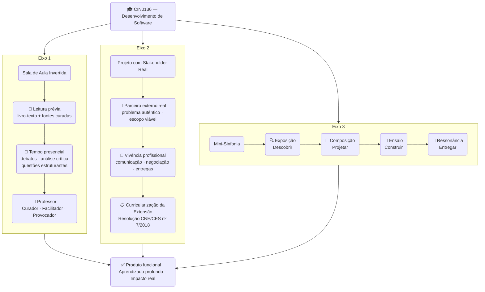

# CIN0136 — Desenvolvimento de Software

**Centro de Informática · Universidade Federal de Pernambuco**

**Curso:** Sistemas de Informação · **Semestre:** 2026.1

**Professor:** Kiev Santos da Gama e Vinicius Cardoso Garcia

**Horários:** Segunda 17:00–18:40 (E132) · Terça 18:50–20:30 (E232) · Quinta 17:00–20:30 (Grad04)

---

> Este repositório é a **fonte de verdade única** da disciplina CIN0136 em 2026.1. Aqui você encontra o plano de ensino, os materiais de cada aula, os templates do projeto de extensão e o calendário completo do semestre. Se há conflito entre este repositório e qualquer outra fonte, **este repositório prevalece**.

---

## Sobre a disciplina

CIN0136 é a disciplina de Desenvolvimento de Software do 2º período do curso de Sistemas de Informação do CIn-UFPE. Ela parte de onde a programação termina: em vez de aprender *como* escrever código, você aprende *como desenvolver software de qualidade* — em equipe, com processo, para usuários reais.

O semestre é estruturado em torno de um **projeto integrador real**: cada equipe de 4–5 alunos desenvolve um MVP para uma organização parceira externa, com 9 encontros formais ao longo das 15 semanas. Não há simulação — há um parceiro real esperando uma entrega real.

A stack tecnológica adotada é JavaScript moderno: **Node.js + Express** no backend, **React via Vite** no frontend, **Vitest** para testes unitários e **Playwright** para testes de aceitação.

---

## Os três eixos metodológicos

A disciplina opera sobre três eixos integrados:



**Eixo 1 — Sala de Aula Invertida:** leituras prévias obrigatórias antes de cada encontro teórico; o tempo presencial é dedicado a debates, análise crítica e cenários de decisão — nunca a aulas meramente expositivas.

**Eixo 2 — Projeto Integrador com Stakeholder Real (Extensão):** equipes trabalham em projetos reais demandados por parceiros externos, atendendo à curricularização da extensão conforme diretrizes do MEC e oferecendo vivência profissional autêntica.

**Eixo 3 — Mini-Sinfonia:** o projeto segue uma versão simplificada da Metodologia Sinfonia (Garcia & Medeiros, 2025), com quatro movimentos — Exposição, Composição, Ensaio e Ressonância — garantindo um processo estruturado de descoberta, design, construção e validação.

---

## Visão do semestre

| Fase | Semanas | Período | Foco |
|------|---------|---------|------|
| **Sprint 0** — Descoberta | 1–5 | 02/03 – 09/04 | Entender o problema, prototipar, fechar escopo |
| **Sprint 1** — Início do desenvolvimento | 6–7 | 06/04 – 30/04 | Primeiras features, arquitetura |
| **Sprint 2** — Features core | 8–9 | 04/05 – 14/05 | MVP em construção, testes |
| **Sprint 3** — Qualidade | 10–11 | 18/05 – 28/05 | Refactoring, robustez |
| **Sprint 4** — Estabilização | 12–13 | 01/06 – 11/06 | Code review cruzado, documentação |
| **Ressonância** — Entrega | 14–15 | 15/06 – 30/06 | Entrega formal, apresentações |

**Marcos importantes:**

| Marco | Data |
|-------|------|
| ✏️ Prova 1 | Terça, 05/05/2026 |
| ✏️ Prova 2 | Terça, 16/06/2026 |
| 🎯 Entrega formal ao stakeholder | Quinta, 18/06/2026 |
| 🎤 Apresentações acadêmicas | 29/06 e 30/06/2026 |

> ⚠️ **Feriados e ajustes:** 02/04 (Quinta-feira Santa), 20–21/04 (Tiradentes), 22–24/06 (São João). Semana de 13–16/04 reservada para Sprint Week autônoma (ICSE). Veja o calendário completo em [PLANEJAMENTO.md](PLANEJAMENTO.md).

---

## Avaliação

| Componente | Peso |
|-----------|------|
| Projeto em Equipe | 60% |
| Provas (2 × 20%) | 40% |
| Participação, Exercícios Individuais e Missões | +10% *(extra)* |

> Detalhamento completo em [docs/avaliacao.md](docs/avaliacao.md).

---

## Stack tecnológica

| Camada | Tecnologia |
|--------|-----------|
| Runtime | Node.js 20+ |
| Backend | Express |
| Frontend | React via Vite |
| Testes unitários | Vitest |
| Testes e2e | Playwright |
| Linter / Formatter | ESLint + Prettier |
| Versionamento | Git + GitHub |
| Gestão do projeto | GitHub Projects (Kanban) |
| Diagramas | Mermaid / draw.io |
| Prototipagem | Figma / Excalidraw |
| Deploy | Vercel / Render |

---

## Como navegar neste repositório

```
cin0136-2026-1/
│
├── README.md                  ← Você está aqui
├── PLANEJAMENTO.md            ← Calendário completo semana a semana
├── equipes.md                 ← Equipes, stakeholders e contatos
│
├── docs/
│   ├── plano-ensino.md        ← Plano de ensino completo
│   ├── metodologia.md         ← Os 3 eixos e a Mini-Sinfonia em detalhe
│   ├── avaliacao.md           ← Critérios, pesos e rubricas
│   └── codigo-conduta.md      ← Código de Conduta e Ética
│
├── semanas/
│   ├── sem01/                 ← Uma pasta por semana
│   │   ├── README.md          ← Visão da semana (objetivos, leituras, entregáveis)
│   │   ├── seg-material-aluno.md
│   │   └── ter-material-aluno.md
│   └── ...
│
├── projeto/
│   ├── canvas-visao-template.md
│   ├── roteiro-primeiro-contato.md
│   ├── formulario-feedback-stakeholder.md
│   └── rubrica-code-review.md
│
└── exercicios/
    ├── EI1-portfolio-git.md
    ├── EI2-documento-requisitos.md
    ├── EI3-testes-js.md
    └── EI4-reflexao-tecnica.md
```

---

## Links rápidos

### Documentos da disciplina
- 📄 [Plano de Ensino](docs/plano-ensino.md)
- 📅 [Planejamento de Aulas 2026.1](PLANEJAMENTO.md)
- ⚖️ [Código de Conduta e Ética](docs/codigo-conduta.md)
- 👥 [Equipes e Stakeholders](equipes.md)

### Materiais do projeto de extensão
- 🗺️ [Canvas de Visão — Template](projeto/canvas-visao-template.md)
- 🗣️ [Roteiro para o 1º Contato com o Stakeholder](projeto/roteiro-primeiro-contato.md)
- 📋 [Formulário de Feedback do Stakeholder](projeto/formulario-feedback-stakeholder.md)

### Exercícios individuais
- [EI1 — Portfólio Git](exercicios/EI1-portfolio-git.md) · entrega: Semana 4
- [EI2 — Documento de Requisitos](exercicios/EI2-documento-requisitos.md) · entrega: Semana 5
- [EI3 — Testes em JavaScript](exercicios/EI3-testes-js.md) · entrega: Semana 9
- [EI4 — Reflexão Técnica e Profissional](exercicios/EI4-reflexao-tecnica.md) · entrega: Semana 13

### Materiais por semana
| Semana | Período | Tema central |
|--------|---------|-------------|
| [Sem 1](semanas/sem01/) | 02–05/03 | Abertura · Ecossistema de DS · Nivelamento JS |
| [Sem 2](semanas/sem02/) | 09–12/03 | Git e GitHub |
| [Sem 3](semanas/sem03/) | 16–19/03 | Code Review · Prototipagem |
| [Sem 4](semanas/sem04/) | 23–26/03 | Processos ágeis · Backlog |
| [Sem 5](semanas/sem05/) | 30/03–09/04 | Requisitos · User Stories · Review Sprint 0 |
| [Sem 6](semanas/sem06/) | 06–23/04 | Design · Arquitetura C4 · Sprint 1 |
| [Sem 7](semanas/sem07/) | 27–30/04 | Qualidade · Sprint 1 Review |
| [Sem 8](semanas/sem08/) | 04–07/05 | **Prova 1** · Testes com Vitest |
| [Sem 9](semanas/sem09/) | 11–14/05 | Testes · Playwright · Sprint 2 Review |
| [Sem 10](semanas/sem10/) | 18–21/05 | Refactoring · Dívida técnica |
| [Sem 11](semanas/sem11/) | 25–28/05 | Qualidade arquitetural · Sprint 3 Review |
| [Sem 12](semanas/sem12/) | 01–04/06 | Code Review avançado · Documentação |
| [Sem 13](semanas/sem13/) | 08–11/06 | **Prova 2** · Sprint 4 Review |
| [Sem 14](semanas/sem14/) | 15–18/06 | Ressonância · Entrega formal |
| [Sem 15](semanas/sem15/) | 29–30/06 | Apresentações · Encerramento |

---

## Bibliografia principal

1. **GARCIA, V. C.** *Engenharia de Software em Dimensões: Da base conceitual à prática profissional.* ASSERT Lab, 2025. *(livro-texto principal)*
2. **GARCIA, V. C.; MEDEIROS, R. P.** *Sinfonia: Metodologia para Desenvolvimento de Produtos de IA.* TDS Books, 2025. *(referência metodológica do projeto)*
3. MARTIN, R. C. *Clean Code.* Prentice Hall, 2008.
4. FORSGREN, N.; HUMBLE, J.; KIM, G. *Accelerate.* IT Revolution Press, 2018.
5. VALENTE, M. T. _Engenharia de Software Moderna_. 2022.
6. MARTIN, R. C. _Clean Architecture: A Craftsman's Guide to Software Structure and Design_. Pearson, 1st ed.
7. FOX, A.; PATTERSON, D. _Engineering Software As a Service: An Agile Approach Using Cloud Computing_.
8. EVANS, E. _Domain-Driven Design_. Alta Books, 3ª ed.
9. SMART, J. _BDD in Action_. Manning Publications, 1st ed.

---

*CIN0136 — Desenvolvimento de Software · CIn-UFPE · 2026.1*
*Última atualização: março de 2026*---
