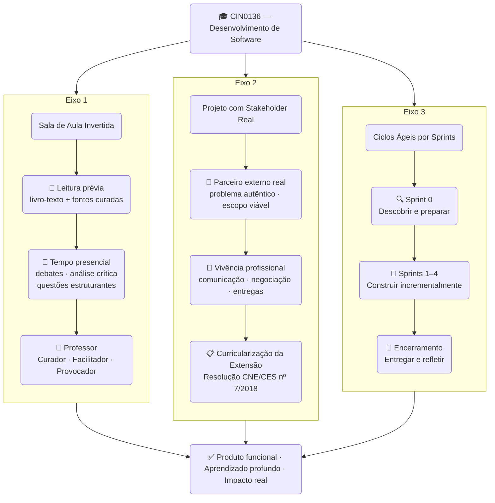

# CIN0136 — Desenvolvimento de Software

**Centro de Informática · Universidade Federal de Pernambuco**

**Curso:** Sistemas de Informação · **Período:** 2º semestre

**Professores:** Kiev Gama e Vinicius Cardoso Garcia

**Horários:** Segunda 18:50–20:30 (E132) · Terça 17:00–18:40 (E132) · Quinta 17:00–20:30 (Grad04)

---

> Este repositório é a **fonte de verdade única** da disciplina CIN0136. Aqui você encontra o plano de ensino, os materiais de cada aula, os templates do projeto de extensão e o cronograma do semestre. Se há conflito entre este repositório e qualquer outra fonte, **este repositório prevalece**.
>
> As **datas** do semestre corrente vivem na planilha de plano de aulas (ver [Cronograma](#cronograma)). Este README descreve *como a disciplina funciona* — a estrutura, a metodologia e os materiais, de forma independente de semestre.

---

## Sobre a disciplina

CIN0136 é a disciplina de Desenvolvimento de Software do 2º período do curso de Sistemas de Informação do CIn-UFPE. Ela parte de onde a programação termina: em vez de aprender *como* escrever código, você aprende *como desenvolver software de qualidade* em equipe, com processo, para usuários reais.

O semestre é estruturado em torno de um **projeto integrador real**: cada equipe de 4–5 alunos desenvolve um MVP para uma organização parceira externa, com encontros formais distribuídos ao longo do semestre. Não há simulação, há um parceiro real esperando uma entrega real.

A stack tecnológica adotada é JavaScript moderno: **Node.js + Express** no backend, **React via Vite** no frontend, **Vitest** para testes unitários e **Playwright** para testes de aceitação.

---

## Os três eixos metodológicos

A disciplina opera sobre três eixos integrados:


```mermaid
flowchart TB
    DISC("🎓 CIN0136 — Desenvolvimento de Software")

    DISC --> E1
    DISC --> E2
    DISC --> E3

    subgraph E1["Eixo 1"]
        direction TB
        L0("Sala de Aula Invertida")
        L1("📖 Leitura prévia<br>livro-texto + fontes curadas")
        L2("💬 Tempo presencial<br>debates · análise crítica<br>questões estruturantes")
        L3("🎯 Professor<br>Curador · Facilitador · Provocador")
        L0 --> L1 --> L2 --> L3
    end

    subgraph E2["Eixo 2"]
        direction TB
        P0("Projeto com Stakeholder Real")
        P1("🤝 Parceiro externo real<br>problema autêntico · escopo viável")
        P2("🔄 Vivência profissional<br>comunicação · negociação · entregas")
        P3("📋 Curricularização da Extensão<br>Resolução CNE/CES nº 7/2018")
        P0 --> P1 --> P2 --> P3
    end

    subgraph E3["Eixo 3"]
        direction TB
        M0("Ciclos Ágeis por Sprints")
        M1("🔍 Sprint 0<br>Descobrir e preparar")
        M2("🔨 Sprints 1–4<br>Construir incrementalmente")
        M3("🚀 Encerramento<br>Entregar e refletir")
        M0 --> M1 --> M2 --> M3
    end

    E1 & E2 & E3 --> OUT("✅ Produto funcional · Aprendizado profundo · Impacto real")
```

**Eixo 1 — Sala de Aula Invertida:** leituras prévias obrigatórias antes de cada encontro teórico; o tempo presencial é dedicado a debates, análise crítica e cenários de decisão, nunca a aulas meramente expositivas.

**Eixo 2 — Projeto Integrador com Stakeholder Real (Extensão):** equipes trabalham em projetos reais demandados por parceiros externos, atendendo à curricularização da extensão conforme diretrizes do MEC e oferecendo vivência profissional autêntica.

**Eixo 3 — Ciclos Ágeis Baseados em Sprints:** o projeto é conduzido em ciclos incrementais curtos, uma **Sprint** 0 de descoberta e preparação, seguido de **quatro sprints de construção (Sprints 1–4)**, cada uma encerrada por uma *review* com o demandante real, e um período final de entrega e reflexão. A cadência garante um processo completo, da descoberta à entrega, com feedback frequente.

---

## Visão do semestre

O semestre percorre quatro fases, conduzidas como ciclos ágeis baseados em sprints:

| Fase | Semanas | Foco |
|------|---------|------|
| **Sprint 0** — Descoberta e Preparação | 1–4 | Entender o problema, elicitar requisitos, prototipar, fechar escopo |
| **Sprint Week** — Ponte (evento) | 5 | Primeiras features de forma autônoma; qualidade como postura |
| **Sprint 1** — Arquitetura e primeiras entregas | 6–7 | Design, arquitetura, C4, UML e ADR · Sprint 1 Review |
| **Sprint 2** — Features core do MVP | 8–9 | Testes (Vitest e Playwright), BDD · Sprint 2 Review |
| **Sprint 3** — Qualidade e evolução | 10–11 | Refactoring, manutenção, dívida técnica · Sprint 3 Review |
| **Sprint 4** — Estabilização e entrega | 12–13 | Code review avançado, documentação, containerização · Sprint 4 Review |
| **Encerramento** — Entrega e Reflexão | 14–16 | Entrega formal ao stakeholder, apresentações, provas |

> Cada sprint de construção encerra com uma **Sprint Review** com o stakeholder. As datas exatas de reviews, provas e entregas estão na planilha de plano de aulas do semestre corrente.

---

## Cronograma

O cronograma detalhado — datas, salas, leituras por seção, entregáveis e feriados de cada aula, é mantido na **planilha de plano de aulas** do semestre corrente, versionada neste repositório. A planilha é a **fonte de verdade** para tudo que depende de calendário.

Este README e o [plano de ensino](docs/plano-ensino.md) descrevem a estrutura e as regras da disciplina de forma independente de datas.

---

## Avaliação

| Componente | Peso |
|-----------|------|
| Projeto em Equipe | 60% |
| Provas (2 × 20%) | 40% |
| Participação, Exercícios Individuais e Missões | +10% *(extra)* |

> Detalhamento completo em [docs/avaliacao.md](docs/avaliacao.md).

---

## Stack tecnológica

| Camada | Tecnologia | Quando entra |
|--------|-----------|--------------|
| Runtime | Node.js 20+ | Sprint 0 |
| Backend | Express | Sprint 0 |
| Frontend | React via Vite | Sprint 0 |
| Banco de dados | SQLite *(local, versionável)* | Sprint 0 → sprints de construção |
| Testes unitários | Vitest | Sprint 2 |
| Testes e2e / aceitação | Playwright | Sprint 2 |
| Linter / Formatter | ESLint + Prettier | Sprint 0 |
| Versionamento | Git + GitHub | Sprint 0 |
| Gestão do projeto | GitHub Projects (ou Jira) | Sprint 0 |
| Diagramas | Mermaid / draw.io — C4 e UML (Classe, ER, Sequência) | Sprint 1 |
| Decisões arquiteturais | ADR (Markdown no repositório) | Sprint 1 |
| Prototipagem | Figma / Excalidraw | Sprint 0 |
| Containerização | Docker + Docker Compose | Sprint 4 |
| Deploy | Vercel / Render / Railway | Sprints de construção |

---

## Como navegar neste repositório

```
cin0136-2026-1/
│
├── README.md                  ← Você está aqui
├── equipes.md                 ← Equipes, stakeholders e contatos
│
├── docs/
│   ├── plano-ensino.md        ← Plano de ensino completo
│   ├── metodologia.md         ← Os 3 eixos e os ciclos de sprint em detalhe
│   ├── avaliacao.md           ← Critérios, pesos e rubricas
│   └── codigo-conduta.md      ← Código de Conduta e Ética
│
├── semanas/
│   ├── sem01/                 ← Uma pasta por semana
│   │   ├── README.md          ← Visão da semana (objetivos, leituras, entregáveis)
│   │   ├── seg-material-aluno.md
│   │   └── ter-material-aluno.md
│   └── ...
│
├── projeto/
│   ├── roteiro-primeiro-contato.md
│   ├── formulario-feedback-stakeholder.md
│   ├── template-adr.md
│   └── rubrica-code-review.md
│
└── exercicios/
    ├── EI1-portfolio-git.md
    ├── EI2-documento-requisitos.md
    ├── EI3-testes-js.md
    └── EI4-reflexao-tecnica.md
```

---

## Links rápidos

### Documentos da disciplina
- 📄 [Plano de Ensino](docs/plano-ensino.md)
- 📊 [Plano de Aulas (planilha)](https://docs.google.com/spreadsheets/d/1rgcpwb1QJ0m0bTaMoO-hLTnpWxjB-6k3OaaMepYzWK8/edit?usp=sharing) — cronograma datado do semestre
- ⚖️ [Código de Conduta e Ética](docs/codigo-conduta.md)
- 👥 [Equipes e Stakeholders](equipes.md)

### Materiais do projeto de extensão
- 🗣️ [Roteiro para o 1º Contato com o Stakeholder](projeto/roteiro-primeiro-contato.md)
- 📋 [Formulário de Feedback do Stakeholder](projeto/formulario-feedback-stakeholder.md)
- 🧩 [Template de ADR](projeto/template-adr.md)
- 🔍 [Rubrica de Code Review](projeto/rubrica-code-review.md)

### Exercícios individuais
- [EI1 — Portfólio Git](exercicios/EI1-portfolio-git.md) · entrega: Sprint 0
- [EI2 — Documento de Requisitos](exercicios/EI2-documento-requisitos.md) · entrega: Sprint 0
- [EI3 — Testes em JavaScript](exercicios/EI3-testes-js.md) · entrega: Sprint 2
- [EI4 — Reflexão Técnica e Profissional](exercicios/EI4-reflexao-tecnica.md) · entrega: Sprint 4

### Materiais por semana
| Semana | Tema central |
|--------|-------------|
| [Sem 1](semanas/sem01/) | Fundamentos de ES · Ecossistema · Workshop Ágil · 👤 Backlog |
| [Sem 2](semanas/sem02/) | Processos ágeis · 👤 Fechamento de escopo · ✅ Sprint 0 |
| [Sem 3](semanas/sem03/) | Requisitos · User Stories · Nivelamento JS · 👤 Stakeholder |
| [Sem 4](semanas/sem04/) | Strateegia: escopo e backlog · 👤 Refinamento |
| [Sem 5](semanas/sem05/) | 🏃 Sprint Week (evento) · Qualidade de Software |
| [Sem 6](semanas/sem06/) | Design e Arquitetura (Parte 1): camadas, APIs, princípios |
| [Sem 7](semanas/sem07/) | Arquitetura (Parte 2) · C4 · UML · ADR · 👤 ✅ Sprint 1 |
| [Sem 8](semanas/sem08/) | Testes: pirâmide, cobertura, BDD · Lab Vitest |
| [Sem 9](semanas/sem09/) | ✏️ **Prova 1** · Testes de aceitação (Playwright) · 👤 ✅ Sprint 2 |
| [Sem 10](semanas/sem10/) | Refactoring · Manutenção · Dívida técnica |
| [Sem 11](semanas/sem11/) | Qualidade arquitetural · Debugging · 👤 ✅ Sprint 3 |
| [Sem 12](semanas/sem12/) | Code Review avançado · Documentação |
| [Sem 13](semanas/sem13/) | Containerização (Docker) · Estabilização · 👤 ✅ Sprint 4 |
| [Sem 14](semanas/sem14/) | Reflexão · ✏️ **Prova 2** · 👤 Entrega formal (feira) |
| [Sem 15](semanas/sem15/) | 🎤 Apresentações acadêmicas · Segunda-chamada |
| [Sem 16](semanas/sem16/) | ✏️ Prova Final |

---

## Bibliografia principal

1. **GARCIA, V. C.** *Engenharia de Software em Dimensões: Da base conceitual à prática profissional.* ASSERT Lab, 2025 (ed. 2025.2.0). *(livro-texto principal)*
2. VALENTE, M. T. *Engenharia de Software Moderna.* 2022.
3. MARTIN, R. C. *Clean Code.* Prentice Hall, 2008.
4. MARTIN, R. C. *Clean Architecture: A Craftsman's Guide to Software Structure and Design.* Pearson, 1st ed.
5. FOX, A.; PATTERSON, D. *Engineering Software As a Service: An Agile Approach Using Cloud Computing.*
6. EVANS, E. *Domain-Driven Design.* Alta Books, 3ª ed.
7. SMART, J. *BDD in Action.* Manning Publications, 1st ed.
8. FORSGREN, N.; HUMBLE, J.; KIM, G. *Accelerate.* IT Revolution Press, 2018.
9. GARCIA, V. C.; MEDEIROS, R. P. *Sinfonia: Metodologia para Desenvolvimento de Produtos de IA.* TDS Books, 2025.

### Referências de apoio (temas fora dos livros-texto)
- NYGARD, M. *Documenting Architecture Decisions.* 2011. — cognitect.com/blog/2011/11/15/documenting-architecture-decisions
- *Architecture Decision Records* — adr.github.io
- *Docker Documentation* — docs.docker.com

---

*CIN0136 — Desenvolvimento de Software · CIn-UFPE*
*Última atualização: 10/08/2026*
