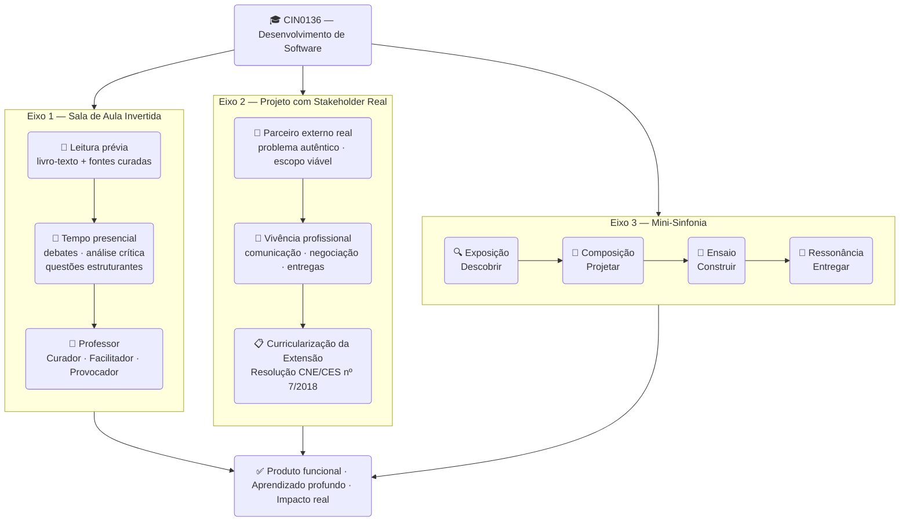

# Metodologia

**CIN0136: Desenvolvimento de Software · CIn-UFPE · 2026.1**

---

## Visão Geral

A disciplina opera sobre três eixos metodológicos integrados. Nenhum dos três funciona isoladamente — é a combinação dos três que cria a experiência de aprendizagem proposta.



---

## Eixo 1 — Sala de Aula Invertida

### O princípio

O tempo presencial é um recurso escasso e caro demais para ser usado em transmissão de conteúdo que o aluno pode consumir por conta própria. A sala de aula invertida redistribui esse recurso: a aquisição de conteúdo acontece antes da aula, e o tempo presencial é reservado para o que só acontece com outras pessoas — debate, questionamento, análise crítica, aplicação a problemas reais.

### Como funciona na prática

A estrutura semanal tem três tempos:

| Tempo | Quando | Propósito | Modo |
|-------|--------|-----------|------|
| **1º Tempo** — Preparação | Antes da aula (segunda ou terça) | Aquisição de conteúdo | Leitura individual do livro-texto ou fontes curadas |
| **2º Tempo** — Debate e análise | Segunda e terça (2h cada) | Aprofundamento crítico | Debates estruturados, questões estruturantes, cenários de decisão |
| **3º Tempo** — Prática e projeto | Quinta (4h) | Consolidação pela ação | Laboratórios, workshops, interação com stakeholder |

### O papel do professor

O professor não é o transmissor principal do conteúdo — esse papel pertence ao livro-texto e às fontes curadas. O professor atua como:

- **Curador:** seleciona as leituras e os ângulos de análise mais produtivos
- **Facilitador:** conduz os debates de forma a aprofundar, não a concluir
- **Provocador:** lança questões que desafiam o óbvio e expõem a complexidade que o texto não captura

### As questões estruturantes

Cada capítulo do livro-texto traz questões estruturantes elaboradas para provocar pensamento crítico, não memorização. Em cada aula teórica, 2–3 questões são selecionadas pelo professor e debatidas em diferentes formatos: discussão aberta, grupos, escrita individual seguida de discussão. Não há respostas certas — há respostas mais fundamentadas.

---

## Eixo 2 — Projeto Integrador com Stakeholder Real (Extensão)

### O enquadramento

O projeto de extensão vinculado à disciplina atende à curricularização da extensão conforme a Resolução CNE/CES nº 7/2018. As horas de extensão são computadas como parte da carga horária prática da disciplina. Isso não é uma exigência burocrática — é uma oportunidade estrutural de conectar a universidade com a sociedade por meio de software que resolve problemas reais.

### O perfil dos parceiros (stakeholders)

Os stakeholders são organizações externas — do terceiro setor, pequenas empresas, coletivos comunitários ou departamentos internos da UFPE — com demandas reais de software viáveis para um semestre. Os critérios de seleção são:

- Problema com escopo entregável como MVP em 15 semanas
- Disponibilidade para 9 sessões formais de interação com a equipe
- Compreensão de que o produto é desenvolvido por alunos em formação
- Compromisso com feedback construtivo e pontual

### Os compromissos mútuos

| Parte | Compromissos |
|-------|-------------|
| **Equipe de alunos** | Entregar MVP funcional, documentado e testado; comunicação profissional e regular; respeito a prazos; honestidade sobre limitações |
| **Stakeholder** | Disponibilidade para 9 sessões; feedback honesto e construtivo; clareza na comunicação de necessidades; compreensão do contexto formativo |
| **Professor** | Mediação da relação; suporte técnico e pedagógico; garantia de que a extensão serve ao aprendizado e ao parceiro simultaneamente |

### Os 9 momentos formais com o stakeholder

| Semana | Data | Momento | Propósito |
|--------|------|---------|-----------|
| 1 | 05/03 | 1º contato | Entender contexto, problema e expectativas |
| 3 | 19/03 | Prototipagem | Validar wireframes e fluxos iniciais |
| 4 | 26/03 | Backlog | Priorizar funcionalidades juntos |
| 5 | 09/04 | Fechamento de escopo | Validar protótipo hi-fi, aprovar MVP |
| 7 | 30/04 | Sprint 1 Review | Validar primeiras funcionalidades |
| 9 | 14/05 | Sprint 2 Review | Validar features core do MVP |
| 11 | 28/05 | Sprint 3 Review | Validar qualidade e ajustes |
| 13 | 11/06 | Sprint 4 Review | Validação final antes da entrega |
| 14 | 18/06 | Entrega formal | Entrega do produto + feedback estruturado |

### Propriedade intelectual

O código produzido é de propriedade compartilhada entre os alunos e a universidade, licenciado sob licença aberta (MIT por padrão), salvo acordo diferente formalizado com o stakeholder. Os alunos mantêm o direito de incluir o projeto em seus portfólios profissionais.

---

## Eixo 3 — Mini-Sinfonia como Framework do Projeto

### O que é a Sinfonia

A Metodologia Sinfonia (Garcia & Medeiros, 2025) é um framework de desenvolvimento de produtos de software que organiza o trabalho em quatro movimentos com propósitos distintos. A **Mini-Sinfonia** é uma adaptação simplificada para o contexto do 2º período: mantém a estrutura dos quatro movimentos e seus artefatos centrais, mas reduz a cerimônia e adapta a linguagem para equipes com menos de um semestre de experiência em desenvolvimento colaborativo.

### Os quatro movimentos

```
EXPOSIÇÃO → COMPOSIÇÃO → ENSAIO → RESSONÂNCIA
```

#### 🔍 Exposição — Descobrir (Semanas 1–3)

O objetivo é entender o problema antes de qualquer solução. A equipe conhece o stakeholder, mapeia o contexto, realiza as primeiras sessões de descoberta e constrói os primeiros esboços visuais.

**O erro mais comum:** querer propor soluções antes de entender o problema. Resistir a essa tentação é a habilidade central desta fase.

**Artefatos:** registro dos contatos com stakeholder · esboços e wireframes iniciais

#### 🎨 Composição — Projetar (Semanas 3–5)

O objetivo é transformar o entendimento do problema em um plano validado. A equipe prototipa, prioriza o backlog com o stakeholder e fecha o escopo do MVP que será construído.

**O erro mais comum:** prometer mais do que é possível construir em 8 semanas. O Canvas de Visão existe para tornar esse limite explícito e aceito por todas as partes.

**Artefatos:** protótipo hi-fi validado · Canvas de Visão · backlog MoSCoW com critérios de aceitação

**Marco:** ✅ Review Sprint 0 — aprovação formal do escopo pelo stakeholder

#### 🔨 Ensaio — Construir e Testar (Semanas 6–13)

O objetivo é construir o produto de forma incremental, com feedback do stakeholder a cada sprint. São 4 sprints de aproximadamente 2 semanas cada, com review ao final de cada um.

**O erro mais comum:** acumular dívida técnica ao longo dos sprints e tentar resolver tudo no final. A regra da disciplina é clara: nenhuma feature é considerada pronta sem pelo menos um teste.

**Artefatos por sprint:** features implementadas e testadas · retrospectiva documentada · backlog atualizado

**Marcos:** ✅ Sprint 1 Review · ✅ Sprint 2 Review · ✅ Sprint 3 Review · ✅ Sprint 4 Review

#### 🎵 Ressonância — Entregar e Aprender (Semanas 14–15)

O objetivo é entregar o produto ao stakeholder, receber o feedback final e refletir sobre a jornada. "Ressonância" porque o que foi construído vai continuar existindo e sendo usado — ou não — depois que o semestre acabar. Essa consciência deve orientar as decisões de qualidade ao longo de todo o semestre.

**Artefatos:** produto entregue (repositório + deploy + documentação) · formulário de feedback do stakeholder · documento de reflexão individual · apresentação acadêmica

---

## A integração dos três eixos

Os três eixos não são paralelos — são interdependentes:

- A **sala de aula invertida** fornece os conceitos e o vocabulário para entender o que está sendo construído
- O **projeto com stakeholder** fornece o contexto real que dá sentido aos conceitos
- A **Mini-Sinfonia** fornece a estrutura que transforma o projeto em aprendizado progressivo e não em caos

Um exemplo concreto: Git (Eixo 1, Semana 2) é ensinado porque o repositório da equipe precisa existir e funcionar (Eixo 2, Semana 2). O repositório segue a estrutura definida pela fase de Ensaio da Sinfonia (Eixo 3). Os três eixos convergem no mesmo momento, para o mesmo propósito.

---

## Referências

- GARCIA, V. C. *Engenharia de Software em Dimensões.* ASSERT Lab, 2025.
- GARCIA, V. C.; MEDEIROS, R. P. *Sinfonia: Metodologia para Desenvolvimento de Produtos de IA.* TDS Books, 2025.
- Resolução CNE/CES nº 7, de 18 de dezembro de 2018. Estabelece as Diretrizes para a Extensão na Educação Superior Brasileira.

---

*CIN0136 — Desenvolvimento de Software · CIn-UFPE · 2026.1*
