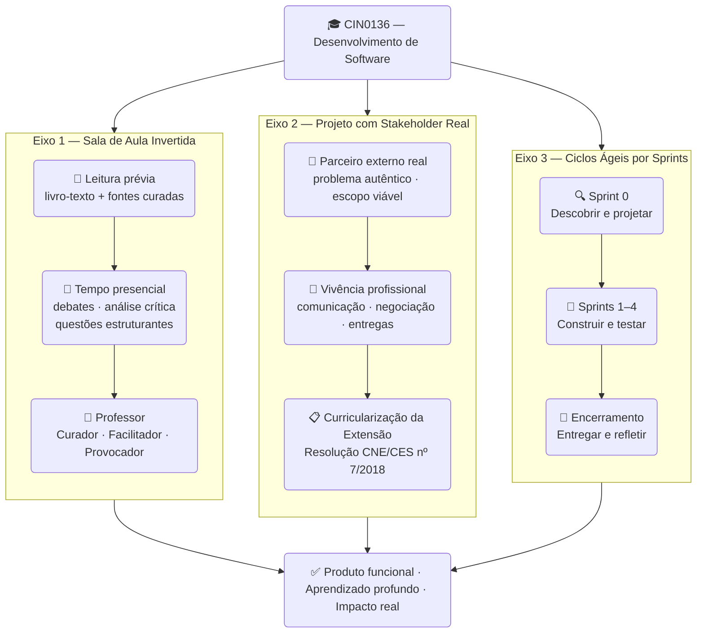

# Metodologia

**CIN0136: Desenvolvimento de Software · CIn-UFPE**

---

## Visão Geral

A disciplina opera sobre três eixos metodológicos integrados. Nenhum dos três funciona isoladamente — é a combinação dos três que cria a experiência de aprendizagem proposta.

```mermaid
flowchart TB
    DISC("🎓 CIN0136 — Desenvolvimento de Software")

    DISC --> E1
    DISC --> E2
    DISC --> E3

    subgraph E1["Eixo 1 — Sala de Aula Invertida"]
        direction TB
        L1("📖 Leitura prévia<br>livro-texto + fontes curadas")
        L2("💬 Tempo presencial<br>debates · análise crítica<br>questões estruturantes")
        L3("🎯 Professor<br>Curador · Facilitador · Provocador")
        L1 --> L2 --> L3
    end

    subgraph E2["Eixo 2 — Projeto com Stakeholder Real"]
        direction TB
        P1("🤝 Parceiro externo real<br>problema autêntico · escopo viável")
        P2("🔄 Vivência profissional<br>comunicação · negociação · entregas")
        P3("📋 Curricularização da Extensão<br>Resolução CNE/CES nº 7/2018")
        P1 --> P2 --> P3
    end

    subgraph E3["Eixo 3 — Ciclos Ágeis por Sprints"]
        direction TB
        M1("🔍 Sprint 0<br>Descobrir e projetar")
        M2("🔨 Sprints 1–4<br>Construir e testar")
        M3("🚀 Encerramento<br>Entregar e refletir")
        M1 --> M2 --> M3
    end

    E1 & E2 & E3 --> OUT("✅ Produto funcional · Aprendizado profundo · Impacto real")
```

---

## Eixo 1 — Sala de Aula Invertida

### O princípio

O tempo presencial é um recurso escasso e caro demais para ser usado em transmissão de conteúdo que o aluno pode consumir por conta própria. A sala de aula invertida redistribui esse recurso: a aquisição de conteúdo acontece antes da aula, e o tempo presencial é reservado para o que só acontece com outras pessoas — debate, questionamento, análise crítica, aplicação a problemas reais.

### Como funciona na prática

A estrutura semanal tem três momentos:

| Momento | Quando | Propósito | Modo |
|---------|--------|-----------|------|
| **Preparação** | Antes da aula | Aquisição de conteúdo | Leitura individual do livro-texto ou fontes curadas |
| **Debate e análise** | Encontros teóricos (segunda e terça) | Aprofundamento crítico | Debates estruturados, questões estruturantes, cenários de decisão |
| **Prática e projeto** | Encontro prático (quinta, 4h) | Consolidação pela ação | Laboratórios, workshops, interação com stakeholder |

### O papel do professor

O professor não é o transmissor principal do conteúdo — esse papel pertence ao livro-texto e às fontes curadas. O professor atua como:

- **Curador:** seleciona as leituras e os ângulos de análise mais produtivos
- **Facilitador:** conduz os debates de forma a aprofundar, não a concluir
- **Provocador:** lança questões que desafiam o óbvio e expõem a complexidade que o texto não captura

### As questões estruturantes

Cada capítulo do livro-texto traz questões estruturantes elaboradas para provocar pensamento crítico, não memorização. Em cada aula teórica, 2–3 questões são selecionadas pelo professor e debatidas em diferentes formatos: discussão aberta, grupos, escrita individual seguida de discussão. Não há respostas certas — há respostas mais fundamentadas.

---

## Eixo 2 — Projeto Integrador com Stakeholder Real (Extensão)

### O enquadramento

O projeto de extensão vinculado à disciplina atende à curricularização da extensão conforme a Resolução CNE/CES nº 7/2018. As horas de extensão são computadas como parte da carga horária prática da disciplina. Isso não é uma exigência burocrática — é uma oportunidade estrutural de conectar a universidade com a sociedade por meio de software que resolve problemas reais.

### O perfil dos parceiros (stakeholders)

Os stakeholders são organizações externas — do terceiro setor, pequenas empresas, coletivos comunitários ou departamentos internos da UFPE — com demandas reais de software viáveis para um semestre. Os critérios de seleção são:

- Problema com escopo entregável como MVP dentro de um semestre
- Disponibilidade para as sessões formais de interação ao longo do projeto (tipicamente uma por fase)
- Compreensão de que o produto é desenvolvido por alunos em formação
- Compromisso com feedback construtivo e pontual

### Os compromissos mútuos

| Parte | Compromissos |
|-------|-------------|
| **Equipe de alunos** | Entregar MVP funcional, documentado e testado; comunicação profissional e regular; respeito a prazos; honestidade sobre limitações |
| **Stakeholder** | Disponibilidade para as sessões de interação ao longo do projeto; feedback honesto e construtivo; clareza na comunicação de necessidades; compreensão do contexto formativo |
| **Professor** | Mediação da relação; suporte técnico e pedagógico; garantia de que a extensão serve ao aprendizado e ao parceiro simultaneamente |

### Os momentos formais com o stakeholder

O stakeholder participa de momentos formais distribuídos ao longo de todo o projeto, garantindo que ele nunca se distancie das necessidades reais. Cada fase do projeto tem ao menos uma interação estruturada:

| Fase | Momento | Propósito |
|------|---------|-----------|
| Sprint 0 | Construção do backlog | Entender contexto e problema; priorizar funcionalidades juntos |
| Sprint 0 | Fechamento de escopo | Validar protótipo hi-fi e aprovar o MVP |
| Sprint 0 | Contato de aprofundamento | Refinar entendimento das necessidades |
| Sprint 1 | Sprint 1 Review | Validar primeiras funcionalidades sobre a arquitetura definida |
| Sprint 2 | Sprint 2 Review | Validar features core do MVP |
| Sprint 3 | Sprint 3 Review | Validar qualidade e ajustes |
| Sprint 4 | Sprint 4 Review | Validar estabilização do MVP |
| Encerramento | Entrega formal | Entrega do produto + feedback estruturado |

> As datas exatas de cada momento estão na planilha de plano de aulas do semestre corrente.

### Propriedade intelectual

O código produzido é de propriedade compartilhada entre os alunos e a universidade, licenciado sob licença aberta (MIT por padrão), salvo acordo diferente formalizado com o stakeholder. Os alunos mantêm o direito de incluir o projeto em seus portfólios profissionais.

---

## Eixo 3 — Ciclos Ágeis Baseados em Sprints

### O princípio

O projeto é conduzido em ciclos incrementais curtos, no espírito das metodologias ágeis estudadas na disciplina. Em vez de planejar tudo no início e construir de uma vez, a equipe descobre, projeta, constrói e valida em ciclos sucessivos, com feedback real do stakeholder a cada etapa. A cadência é dimensionada para o nível de maturidade do 2º período: um Sprint 0 de descoberta e preparação, quatro sprints de construção e um encerramento de entrega e reflexão.

A estrutura organiza o semestre em três fases, cada uma com um propósito distinto e um erro típico a evitar.

### 🔍 Sprint 0 — Descobrir e Projetar

O objetivo é entender o problema antes de qualquer solução e, em seguida, transformar esse entendimento em um plano validado. A equipe conhece o stakeholder, mapeia o contexto, realiza as primeiras sessões de descoberta, prototipa, prioriza o backlog e fecha o escopo do MVP que será construído.

**O erro mais comum (descoberta):** querer propor soluções antes de entender o problema. Resistir a essa tentação é a habilidade central do início do projeto.

**O erro mais comum (projeto):** prometer mais do que é possível construir no tempo disponível. O fechamento de escopo com o stakeholder existe justamente para tornar esse limite explícito e aceito por todas as partes.

**Artefatos:** registro dos contatos com o stakeholder · protótipo hi-fi validado · backlog MoSCoW com critérios de aceitação · escopo do MVP aprovado

**Marco:** ✅ Review Sprint 0 — aprovação formal do escopo pelo stakeholder

### 🔨 Sprints 1–4 — Construir e Testar

O objetivo é construir o produto de forma incremental, com feedback do stakeholder ao final de cada sprint. São quatro sprints de aproximadamente duas semanas cada, com uma review de fechamento em cada um. A teoria de cada sprint é calibrada para o que a equipe precisa naquele momento: arquitetura e documentação (C4, UML, ADR) no Sprint 1; testes no Sprint 2; refactoring e manutenção no Sprint 3; code review avançado e containerização no Sprint 4.

**O erro mais comum:** acumular dívida técnica ao longo dos sprints e tentar resolver tudo no final. A regra da disciplina é clara: nenhuma feature é considerada pronta sem pelo menos um teste.

**Artefatos por sprint:** features implementadas e testadas · decisões arquiteturais registradas (ADR) · retrospectiva documentada · backlog atualizado

**Marcos:** ✅ Sprint 1 Review · ✅ Sprint 2 Review · ✅ Sprint 3 Review · ✅ Sprint 4 Review

### 🚀 Encerramento — Entregar e Refletir

O objetivo é entregar o produto ao stakeholder, receber o feedback final e refletir sobre a jornada. O que foi construído vai continuar existindo e sendo usado — ou não — depois que o semestre acabar. Essa consciência deve orientar as decisões de qualidade ao longo de todo o projeto: constrói-se pensando em quem vai manter e usar o software depois.

**Artefatos:** produto entregue (repositório + deploy + documentação) · formulário de feedback do stakeholder · documento de reflexão individual · apresentação acadêmica

---

## A integração dos três eixos

Os três eixos não são paralelos — são interdependentes:

- A **sala de aula invertida** fornece os conceitos e o vocabulário para entender o que está sendo construído
- O **projeto com stakeholder** fornece o contexto real que dá sentido aos conceitos
- Os **ciclos ágeis por sprints** fornecem a estrutura que transforma o projeto em aprendizado progressivo e não em caos

Um exemplo concreto: Git é ensinado (Eixo 1) porque o repositório da equipe precisa existir e funcionar desde o primeiro dia (Eixo 2). O repositório segue a estrutura e a cadência de entregas definidas pelos sprints (Eixo 3). Os três eixos convergem no mesmo momento, para o mesmo propósito — cada conceito teórico é introduzido quando o projeto cria a necessidade concreta dele.

---

## Referências

- GARCIA, V. C. *Engenharia de Software em Dimensões.* ASSERT Lab, 2025.
- Resolução CNE/CES nº 7, de 18 de dezembro de 2018. Estabelece as Diretrizes para a Extensão na Educação Superior Brasileira.

---

*CIN0136 — Desenvolvimento de Software · CIn-UFPE*
