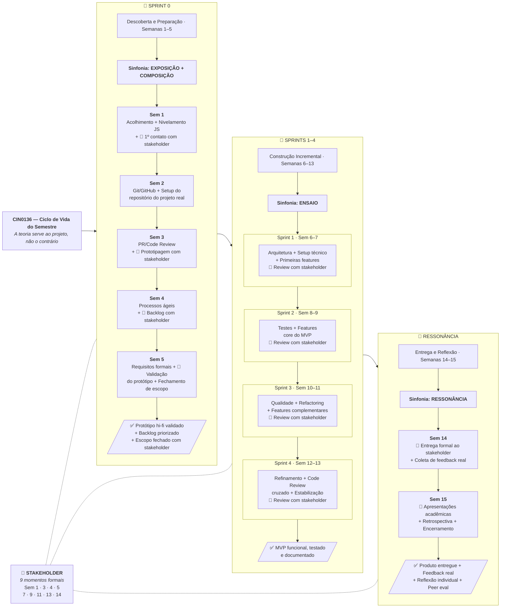

# PLANO DE ENSINO — CIN0136: Desenvolvimento de Software (v3)

## Bacharelado em Sistemas de Informação | Centro de Informática — UFPE

**Professores:** Kiev Santos da Gama e Vinicius Cardoso Garcia

**Emails**: {kiev, vinicius}@cin.ufpe.br

**Período Letivo:** 2026.1 | **Semestre Ideal:** 2º  

**Carga Horária:** 120h (60h Teóricas + 60h Práticas)  

**Créditos:** 6  

**Pré-requisito:** Introdução à Programação  

**Horários:**

|Dia|Horário|Duração|Natureza|
|---|---|---|---|
|Segunda-feira|17:00–18:40|2h|Teórica — Conceitos, leituras, debates|
|Terça-feira|18:50–20:30|2h|Teórica — Aprofundamento, estudos de caso, questões estruturantes|
|Quinta-feira|17:00–20:30|4h|Prática — Consolidação, workshops, laboratórios, projeto com stakeholder|

---

## 1. FILOSOFIA E ABORDAGEM PEDAGÓGICA

### 1.1 Princípios Norteadores

Este plano de ensino foi construído a partir de quatro premissas fundamentais:

**Premissa 1 — A imaturidade é o ponto de partida, não um obstáculo.** Os alunos do 2º período possuem, em geral, apenas um semestre de programação (tipicamente em Python ou C). Muitos ainda não consolidaram pensamento algorítmico, não têm experiência com projetos colaborativos e desconhecem o ecossistema profissional de desenvolvimento de software. O plano trata essa condição com realismo: os conceitos são introduzidos de forma gradual, a complexidade escala progressivamente, e cada nova camada se apoia na anterior.

**Premissa 2 — Soft skills não se ensinam em tópicos isolados; emergem de práticas intencionais.** Competências como trabalho em equipe, resolução de problemas, ética e comunicação não são conteúdos a serem "ministrados" em aulas específicas. Elas são cultivadas através de atividades cuidadosamente desenhadas — interações com stakeholders reais, debates estruturados, revisões por pares, retrospectivas, apresentações e decisões coletivas — que permeiam todo o semestre.

**Premissa 3 — Aprender a desenvolver software é aprender a pensar sobre o desenvolvimento de software.** A disciplina não visa apenas transmitir técnicas, mas desenvolver a capacidade de refletir criticamente sobre quando, por que e como aplicá-las. Isso prepara o aluno tanto para o exercício profissional imediato quanto para as transformações que inevitavelmente ocorrerão ao longo da sua carreira — incluindo a crescente mediação por ferramentas de Inteligência Artificial, que será aprofundada na disciplina ESAIA (IF1015) no 6º período.

**Premissa 4 — Problemas reais geram aprendizados reais.** A integração do projeto de extensão com demandantes externos não é um acessório pedagógico — é o motor central da disciplina. Quando o aluno sabe que existe alguém esperando o resultado do seu trabalho, a motivação muda de natureza: deixa de ser extrínseca (nota) e passa a ser intrínseca (responsabilidade, orgulho, impacto). Essa vivência profissional desde o 2º período é um diferencial formativo que prepara para o mercado de trabalho com dois anos de antecedência.

### 1.2 Metodologia

A disciplina opera sobre três eixos metodológicos integrados:

**Eixo 1 — Sala de Aula Invertida.** Antes de cada encontro teórico (segunda e terça), os alunos realizam leituras preparatórias a partir dos capítulos do livro-texto _Engenharia de Software em Dimensões_ (Garcia, 2025). O tempo presencial é dedicado a debates estruturados, análise crítica, questões estruturantes e cenários de decisão — nunca a aulas meramente expositivas. O professor atua como facilitador e provocador.

**Eixo 2 — Projeto Integrador com Stakeholder Real (Extensão).** As equipes trabalham em projetos reais demandados por parceiros externos, dentro do projeto de extensão vinculado à disciplina. Isso atende à curricularização da extensão conforme diretrizes do MEC e oferece aos alunos vivência profissional autêntica: comunicação com não-técnicos, negociação de escopo, entregas incrementais com feedback real.

**Eixo 3 — Mini-Sinfonia como Framework do Projeto.** O projeto segue uma versão simplificada da Metodologia Sinfonia (Garcia & Medeiros, 2025), adaptada para o nível de maturidade do público-alvo, garantindo que os alunos vivenciem um processo estruturado de descoberta, design, construção e validação.

### 1.3 Ritmo Semanal — O Ciclo de Três Tempos

A estrutura semanal segue uma progressão deliberada que respeita os diferentes tempos de aprendizagem:

|Tempo|Dia|Metáfora|Função Pedagógica|
|---|---|---|---|
|1º Tempo — Exposição|Segunda (2h)|"Abrir a partitura"|Introduzir conceitos novos a partir de leituras prévias. O professor contextualiza, provoca e debate. Foco em _o quê_ e _por quê_.|
|2º Tempo — Aprofundamento|Terça (2h)|"Estudar os compassos"|Aprofundar com estudos de caso, questões estruturantes do livro, cenários de decisão. Foco em _e se?_ e _depende de quê?_.|
|3º Tempo — Consolidação e Projeto|Quinta (4h)|"Ensaiar a peça"|Prática guiada, workshops, laboratórios e **trabalho no projeto real com stakeholder**. Foco em _fazer_, _entregar_ e _aprender fazendo_.|

Essa cadência garante que nenhum conceito seja cobrado na prática sem antes ter sido discutido e analisado criticamente. A quinta-feira é o "dia do projeto" desde a Semana 1 — o espaço onde a teoria ganha corpo, os erros são esperados e o aprendizado é consolidado pela experiência concreta.

### 1.4 Stack Tecnológica

A disciplina utiliza o ecossistema JavaScript, alinhado às oportunidades de mercado e à convergência das ferramentas modernas de desenvolvimento (incluindo as assistidas por IA):

|Camada|Tecnologia|Justificativa|
|---|---|---|
|Linguagem|JavaScript (ES6+) / TypeScript (opcional)|Unifica frontend e backend; reduz carga cognitiva|
|Runtime/Backend|Node.js + Express|Simplicidade, vasto ecossistema, padrão de mercado|
|Frontend|React (via Vite)|Padrão de mercado, compatível com ferramentas IA|
|Testes unitários|Vitest|Rápido, API compatível com Jest, integrado ao Vite|
|Testes e2e/aceitação|Playwright|Moderno, cross-browser, boa documentação|
|Linter/Formatter|ESLint + Prettier|Qualidade e consistência de código desde o dia 1|
|Banco de dados|SQLite (início) → PostgreSQL (se necessário)|Simplicidade para 2º período; migração natural|
|Deploy|Vercel (frontend) + Render ou Railway (backend)|Free tiers generosos; deploy simples|

**Nota sobre Next.js:** Embora seja uma ferramenta excelente e dominante no mercado, a mistura de server/client components e as convenções de roteamento de Next.js adicionam complexidade conceitual que compete com o foco da disciplina (engenharia de software, não domínio de framework). React via Vite mantém a separação frontend/backend explícita, reforçando os conceitos de modularização e arquitetura. Next.js é apresentado como "o que vocês encontrarão no mercado" — e poderá ser explorado na ESAIA.

**Nota sobre a transição de linguagem:** Os alunos chegam com experiência em Python ou C. A Semana 1 inclui nivelamento em JavaScript já contextualizado no projeto, para que a transição seja motivada por um propósito concreto, não abstrato.

### 1.5 Estratégia de Avaliação

|Componente|Peso|Descrição|
|---|---|---|
|Projeto em Equipe|60%|Sprint 0 review + 4 sprint reviews com stakeholder + entrega formal + apresentação acadêmica|
|Provas (2 × 20%)|40%|Duas provas escritas individuais (Semana 8 e Semana 13)|
|Participação, Exercícios Individuais e Missões|+10% _(extra)_|Engajamento nos debates, 4 exercícios individuais (EI1–EI4) e missões opcionais ao longo do semestre|

> A nota base é formada pelo Projeto (60%) e pelas Provas (40%). O componente extra é adicional — pode elevar a nota acima de 10,0 mas temos o limite institucional. Detalhamento completo em `docs/avaliacao.md`.

---

## 2. FLUXO GERAL DO SEMESTRE

O semestre é organizado em torno do ciclo de vida do projeto real, com a teoria servindo ao projeto:

### 2.1 Mapeamento Sinfonia → Semestre

|Movimento da Sinfonia|Fase do Semestre|Semanas|Artefato de Saída|
|---|---|---|---|
|**Exposição** — Alinhar Estratégia|Sprint 0 (parte 1)|1–3|Canvas de Visão do Projeto (simplificado)|
|**Composição** — Desenhar a Solução|Sprint 0 (parte 2)|3–5|Protótipo hi-fi validado + Backlog priorizado|
|**Ensaio** — Construir e Testar|Sprints 1–4|6–13|MVP funcional, testado e documentado|
|**Ressonância** — Medir e Aprender|Entrega e Reflexão|14–15|Feedback do stakeholder + Documento de reflexão|

### 2.2 Correspondência Ementa → Livro-Texto → Semanas

|Conteúdo Programático (Ementa)|Capítulo(s) do Livro|Semana(s)|
|---|---|---|
|Introdução ao gerenciamento de projetos|Cap. 1 — Engenharia de Software|1|
|Introdução ao controle de versão|Cap. 3 — Versionamento e Gerência de Configuração|2–3|
|Metodologias ágeis de desenvolvimento|Cap. 4 — Processos de Software|4|
|Intro à Engenharia de Requisitos ágil|Cap. 6 e Cap. 7 — Requisitos|5|
|Arquitetura de software e Modularização|Cap. 14 — Fundamentos de Arquitetura (seções selecionadas)|6–7|
|Testes de software|Cap. 8 e Cap. 9 — Qualidade e Testes|8–9|
|Code Review|Cap. 3, seção 3.5|3, 12|
|Refactoring|Cap. 19, seção 19.3.1|10–11|

---

## 3. CRONOGRAMA DETALHADO — SEMANA A SEMANA

> **Convenção de leitura:**
> 
> - 🔵 **SEG** = Segunda-feira (2h, teórica — conceitos)
> - 🟢 **TER** = Terça-feira (2h, teórica — aprofundamento)
> - 🟠 **QUI** = Quinta-feira (4h, prática — consolidação e projeto)
> - 📖 = Leitura prévia obrigatória
> - 🎯 = Entregável da semana
> - 👤 = Momento de interação com stakeholder

---

## SPRINT 0 — DESCOBERTA E PREPARAÇÃO (Semanas 1–5)

### 🎼 Sinfonia: Exposição + Composição

> **Propósito:** Acolher, nivelar, formar equipes, conhecer o stakeholder, entender o problema, prototipar e fechar escopo. Os conceitos teóricos (ES, Git, processos, requisitos) são introduzidos **a serviço** do projeto desde o primeiro dia.

---

#### 📅 Semana 1 — Abertura: O que é desenvolver software? + Primeiro contato com o projeto

**🔵 SEG — O mundo além do código**

- 📖 Leitura prévia: Cap. 1, seções 1.1 a 1.3 (O que é ES? Diferencial da ES; Desafios técnicos e organizacionais)
- Dinâmica de apresentação: "Quem sou eu no contexto da tecnologia?"
- Discussão provocativa: "Qual é a diferença entre programar e desenvolver software?"
- Apresentação do plano de ensino, metodologia, contrato pedagógico e projeto de extensão
- Apresentação dos desafios/demandantes reais — visão geral dos projetos disponíveis

**🟢 TER — Ecossistema do desenvolvimento de software + Introdução à Sinfonia**

- 📖 Leitura prévia: Cap. 1, seções 1.4 a 1.7 + Sinfonia Cap. 2 (Visão Geral dos 4 Movimentos)
- Mapa mental coletivo: papéis, atividades e artefatos no desenvolvimento de software
- Apresentação da Mini-Sinfonia como framework do projeto do semestre
- Apresentação e assinatura do Código de Conduta e Ética
- Formação exploratória de equipes (4–5 integrantes) e alocação de stakeholders
- Debate com Questões Estruturantes do Cap. 1 (selecionar 2)

**🟠 QUI — Workshop de Nivelamento JavaScript + 👤 Primeiro Contato com Stakeholder (4h)**

- Bloco 1 (2h) — **Nivelamento JavaScript:**
    - Transição de Python/C para JavaScript: variáveis, funções, arrays, objetos, arrow functions, template literals
    - Exercícios guiados: resolver 4 problemas progressivos em JavaScript (mesma lógica que fariam em Python, agora em JS)
    - Setup do ambiente: Node.js, VS Code com extensões (ESLint, Prettier), terminal
    - Exercício: criar um mini-servidor Express com 2 rotas que retornam JSON ("Hello World" e dados simulados do domínio do projeto)
- Bloco 2 (2h) — **👤 Exposição: Primeiro contato com o stakeholder:**
    - Cada equipe se reúne com seu demandante (presencial ou remoto) — formato: conversa livre guiada por roteiro mínimo fornecido pelo professor
    - Foco: entender o contexto do demandante, o problema que enfrenta, suas expectativas
    - Após o encontro: cada equipe registra as primeiras impressões e perguntas em aberto
    - Discussão em plenária: "O que vocês aprenderam? O que ainda não sabem?"
- 🎯 Ambiente JS funcional + Mini-servidor Express rodando + Registro do 1º contato com stakeholder + Reflexão individual (1 página): expectativas para a disciplina
- Habilidades transversais: comunicação, escuta ativa, empatia, adaptação

---

#### 📅 Semana 2 — Git e GitHub: Trabalhando juntos no mesmo código

**🔵 SEG — Por que versionar? Fundamentos de Git**

- 📖 Leitura prévia: Cap. 3, seções 3.1 a 3.3 (Introdução à Gestão de Configuração; Ferramentas; Conceitos fundamentais — commits, branches, merge)
- Debate: "Você já perdeu código? Já teve medo de alterar algo que funcionava?"
- Demonstração ao vivo: ciclo básico do Git (init, add, commit, log, diff, status)
- Modelo mental: working directory → staging area → repository

**🟢 TER — Branches, merges e estratégias de colaboração**

- 📖 Leitura prévia: Cap. 3, seções 3.4.1 a 3.4.6 (Git Flow, Feature Branch, Trunk-Based Development, Merge)
- Análise comparativa das estratégias para diferentes cenários
- Discussão: "Qual estratégia faz sentido para o nosso projeto de extensão?"
- Simulação conceitual de conflito de merge

**🟠 QUI — Laboratório Git + Setup do Repositório do Projeto Real (4h)**

- Bloco 1 (2h) — **Laboratório Git:**
    - Exercício individual: criar repositório JS, fazer 10 commits semânticos, criar e mesclar branches, navegar pelo histórico
    - Exercício em duplas: repositório compartilhado, feature branches, merge, simulação e resolução de conflitos — repetir até ficar natural
- Bloco 2 (2h) — **Setup do projeto real:**
    - Criação do repositório da equipe no GitHub: README estruturado, .gitignore (Node.js), licença, branch protection rules, template de PR
    - Scaffolding do projeto: `npm init`, estrutura de pastas (src/, tests/, docs/), configuração de ESLint + Prettier
    - Setup inicial do backend (Express) e frontend (Vite + React) — boilerplate funcional
    - Cada membro faz um commit inaugural no projeto real
- 🎯 Repositório individual (10+ commits) + Repositório do projeto real configurado e funcional (Hello World full-stack)
- Habilidades transversais: colaboração, resolução de problemas, disciplina técnica

---

#### 📅 Semana 3 — Code Review + 👤 Prototipagem com Stakeholder

**🔵 SEG — Pull Requests e Code Review: mais que revisão técnica**

- 📖 Leitura prévia: Cap. 3, seções 3.5.1 e 3.5.2 (Pull Requests e Code Reviews; GitHub, GitLab, Bitbucket)
- Demonstração: anatomia de um PR no GitHub (título, descrição, diff, comentários, aprovação)
- Discussão: "O que distingue um bom comentário de code review de um inútil?"
- Apresentação da rubrica de code review da disciplina

**🟢 TER — Propriedade intelectual, licenças e ética no desenvolvimento**

- 📖 Leitura prévia: Cap. 3, seções 3.6 e 3.7 (Benefícios da Gestão de Configuração; Conclusão)
- Debate: "Quem é dono do código que vocês escreverão para o stakeholder? E se usarem código gerado por IA?"
- Licenças de software (MIT, GPL, Apache) e implicações para o projeto de extensão
- Questões éticas: plágio, atribuição, contribuições open source, responsabilidade com o demandante

**🟠 QUI — Laboratório Code Review + 👤 Prototipagem com Stakeholder (4h)**

- Bloco 1 (1.5h) — **Laboratório de Code Review:**
    - Exercício formal em duplas: abrir PR → revisar com checklist → solicitar mudanças → corrigir → aprovar → merge
    - Repetir com nova dupla para consolidar
- Bloco 2 (2.5h) — **👤 Composição: Prototipagem com o stakeholder:**
    - Mini-workshop de prototipagem rápida: sketches em papel → wireframes digitais (Figma free, Excalidraw ou similar)
    - Cada equipe constrói protótipos low-fi/mid-fi das telas principais com base no que aprendeu no 1º contato
    - 👤 Sessão de validação com stakeholder: apresentar protótipos, coletar feedback direto, iterar ao vivo
    - Registrar: o que o stakeholder aprovou, o que pediu para mudar, o que gerou dúvida
- 🎯 4 PRs (2 abertos + 2 revisados) + Protótipos validados pelo stakeholder + Registro de feedback
- Habilidades transversais: comunicação construtiva, feedback, empatia, propriedade intelectual

---

#### 📅 Semana 4 — Processos Ágeis + 👤 Construção do Backlog

**🔵 SEG — Do caos ao processo: modelos de desenvolvimento de software**

- 📖 Leitura prévia: Cap. 4, seções 4.1 e 4.2 (Modelo Cascata; Modelos Incremental e Iterativo)
- Modelos clássicos como respostas históricas a problemas de coordenação
- Debate: "O modelo cascata é realmente ruim ou apenas mal compreendido?"
- Análise: "Olhando para o nosso projeto real — o que já estamos fazendo que se parece com um processo?"

**🟢 TER — Metodologias ágeis: Scrum, Kanban e a escolha do processo**

- 📖 Leitura prévia: Cap. 4, seções 4.3 a 4.5 (Scrum, Kanban, Lean, Comparação, Critérios de escolha)
- Comparação prática: Scrum vs. Kanban — quando usar cada um?
- Debate com Questões Estruturantes do Cap. 4 (selecionar 2–3)
- Provocação: "Para o nosso projeto com stakeholder real, qual cadência faz mais sentido?"

**🟠 QUI — Workshop Ágil + 👤 Construção do Backlog com Stakeholder (4h)**

- Bloco 1 (1.5h) — **Workshop Ágil:**
    - Atividade lúdica: "Construindo sem plano" (com LEGO ou equivalente digital) → repetir com mini-sprint estruturada → comparar
    - Configuração do quadro Kanban da equipe (GitHub Projects) com colunas: Backlog → To Do → In Progress → Review → Done
    - Planning poker simplificado: como estimar esforço
- Bloco 2 (2.5h) — **👤 Construção do backlog com stakeholder:**
    - 👤 Sessão com stakeholder: detalhar funcionalidades desejadas, priorizar juntos
    - Cada equipe transforma as conversas em itens de backlog (ainda informais — a formalização em user stories virá na Semana 5)
    - Priorização colaborativa: o que é mais urgente para o demandante? O que é mais viável para a equipe?
    - Definição dos papéis internos da equipe e acordos de trabalho
- 🎯 Quadro Kanban configurado + Backlog informal priorizado com stakeholder + Acordos de equipe
- **Exercício Individual 1 — "Meu portfólio Git":** repositório pessoal JavaScript com projeto organizado, commits semânticos, branches com propósito, README completo, e pelo menos 1 PR com self-review documentado (entrega até domingo)
- Habilidades transversais: resolução de problemas, criatividade, negociação, trabalho em equipe

---

#### 📅 Semana 5 — Requisitos + 👤 Validação e Fechamento de Escopo

**🔵 SEG — Requisitos funcionais, não funcionais e técnicas de elicitação**

- 📖 Leitura prévia: Cap. 6, seções 6.1 e 6.2 (Requisitos Funcionais e Não Funcionais; Técnicas de Elicitação)
- Exercício provocativo: "Descreva o que o WhatsApp faz" — observar como descrições divergem
- Distinção funcional vs. não funcional com exemplos concretos
- Técnicas de elicitação: entrevistas, workshops, observação, prototipagem
- Reflexão: "Quais técnicas já usamos com nosso stakeholder sem saber o nome delas?"

**🟢 TER — User Stories, backlog e priorização formal**

- 📖 Leitura prévia: Cap. 7, seções 7.1.2 a 7.2.4 (User Stories, Epics, Features, MoSCoW, WSJF)
- Workshop: escrita de user stories no formato "Como [persona], quero [funcionalidade] para [benefício]"
- Critérios de qualidade (INVEST)
- Exercício de priorização com MoSCoW
- Debate com Questões Estruturantes do Cap. 7 (selecionar 2)

**🟠 QUI — 👤 Validação do Protótipo Hi-Fi + Fechamento de Escopo (4h)**

- 📖 Leitura prévia: Sinfonia — Cap. 4, seção 4.1 (Exposição) e Cap. 5, seção 5.1 (Composição)
- Bloco 1 (2h) — **Formalização:**
    - Cada equipe converte o backlog informal em user stories formais com critérios de aceitação
    - Priorização com MoSCoW do backlog completo
    - Preenchimento do Canvas de Visão do Projeto (versão simplificada do Canvas de Estratégia e Ação da Sinfonia)
    - Definição do MVP: "Se pudéssemos entregar apenas 3 funcionalidades, quais seriam?"
- Bloco 2 (2h) — **👤 Sessão de fechamento de escopo com stakeholder:**
    - Apresentação do protótipo hi-fi refinado (evoluído desde a Semana 3)
    - Apresentação do backlog priorizado e proposta de MVP
    - 👤 Stakeholder valida, ajusta, aprova o escopo
    - Registro formal: o que está dentro do MVP, o que fica para depois, o que mudou
- 🎯 Canvas de Visão + Backlog de user stories priorizado com MoSCoW + Protótipo hi-fi validado + Escopo fechado e assinado com stakeholder
- **Exercício Individual 2 — "Documento de Requisitos":** dado um sistema fictício, o aluno deve: (1) listar requisitos funcionais e não funcionais, (2) escrever 8 user stories com critérios de aceitação, (3) priorizar com MoSCoW, (4) identificar os 3 atributos de qualidade mais críticos e justificar (entrega até domingo)
- **✅ Review do Sprint 0:** Canvas de Visão + Backlog priorizado + Protótipo validado + Escopo fechado

---

## SPRINTS 1–4 — CONSTRUÇÃO INCREMENTAL (Semanas 6–13)

### 🎼 Sinfonia: Ensaio — Construir e Testar

> **Propósito:** Construção incremental do MVP em 4 sprints de ~2 semanas cada. A teoria de cada quinzena é calibrada para o que a equipe precisa naquele momento do projeto. Sprint reviews com stakeholder acontecem na quinta-feira da semana par de cada sprint.

---

### 🏃 SPRINT 1 — Arquitetura + Primeiras Funcionalidades (Semanas 6–7)

> **Foco técnico:** Princípios de design, C4 Model, setup da arquitetura do projeto, primeiras features.

#### 📅 Semana 6 — Princípios de Design e Arquitetura

**🔵 SEG — Por que a organização do código importa**

- 📖 Leitura prévia: Cap. 14, seções 14.1.1 e 14.1.2 (Princípios fundamentais; Integração no design)
- Exercício provocativo: dois códigos JavaScript que fazem a mesma coisa — um bem organizado, outro caótico. "Qual vocês preferem manter?"
- Princípios acessíveis para 2º período: separação de responsabilidades, coesão, acoplamento, abstração, nomes significativos
- Conexão com o projeto: "Como organizaremos nosso código para que 4 pessoas trabalhem sem pisar no pé uma da outra?"

**🟢 TER — C4 Model: desenhando a arquitetura do nosso projeto**

- 📖 Leitura prévia: Cap. 14, seções 14.3.1 a 14.3.3 (Estrutura hierárquica do C4) e seção 14.4 (C4 vs UML)
- Demonstração: diagramas de Contexto (Nível 1) e Contêiner (Nível 2) para um sistema semelhante aos projetos das equipes
- Discussão: "Por que documentamos a arquitetura se ela pode mudar?"
- Ferramenta: Mermaid (integra com GitHub) ou draw.io

**🟠 QUI — Workshop de Arquitetura + Início do Desenvolvimento (4h)**

- Bloco 1 (2h) — **Workshop de Arquitetura:**
    - Cada equipe desenha os diagramas C4 do seu projeto: Contexto (Nível 1), Contêiner (Nível 2), Componentes (Nível 3 do módulo principal)
    - Definição da estrutura de pastas e módulos do projeto (backend: rotas, controllers, services, models; frontend: pages, components, hooks, services)
    - Decisões arquiteturais documentadas: "Escolhemos X porque..."
- Bloco 2 (2h) — **Início do desenvolvimento:**
    - Implementação do scaffold arquitetural real no repositório
    - Divisão de tarefas: cada membro assume features do Sprint 1
    - Pair programming guiado — professor circula entre equipes
    - Primeiros PRs com features reais
- 🎯 Diagramas C4 no repositório + Estrutura arquitetural implementada + Primeiras features em PR

---

#### 📅 Semana 7 — Qualidade de Software + Sprint 1 Review

**🔵 SEG — O que é qualidade de software? (Não é só "funcionar")**

- 📖 Leitura prévia: Cap. 8, seções 8.1.1 a 8.1.8 (Critérios de qualidade: funcionalidade, desempenho, usabilidade, confiabilidade, segurança, manutenibilidade)
- Atividade: classificar softwares conhecidos de 1 a 5 em qualidade — observar divergência de critérios
- Para cada atributo, identificação no projeto: "Qual é o mais crítico para o nosso stakeholder?"
- Debate com Questões Estruturantes do Cap. 8 (selecionar 2)

**🟢 TER — Medição de qualidade e cultura de qualidade contínua**

- 📖 Leitura prévia: Cap. 8, seções 8.2 e 8.3 (Técnicas de medição; Avaliação contínua)
- Debate: "Qualidade custa caro? Ou a falta de qualidade custa mais?"
- Conexão com o stakeholder: "Quando entregarmos o produto, como o demandante saberá se tem qualidade?"
- Preparação para a Sprint Review: o que mostrar, como demonstrar, como receber feedback

**🟠 QUI — Desenvolvimento + 👤 Sprint 1 Review com Stakeholder (4h)**

- Bloco 1 (2h) — **Desenvolvimento:**
    - Finalização das features do Sprint 1
    - Merge dos PRs pendentes, resolução de conflitos
    - Preparação da demo para o stakeholder
- Bloco 2 (2h) — **👤 Sprint 1 Review:**
    - Cada equipe demonstra ao stakeholder o que foi construído (10 min demo + 5 min feedback)
    - Stakeholder valida, sugere ajustes, prioriza próximos passos
    - Retrospectiva interna da equipe: "O que funcionou? O que precisamos melhorar?"
    - Planejamento do Sprint 2: ajuste do backlog com base no feedback
- 🎯 Features do Sprint 1 entregues + Feedback do stakeholder registrado + Retrospectiva documentada
- **✅ Sprint 1 Review:** Funcionalidades demonstradas + Diagramas C4 + Retrospectiva

---

### 🏃 SPRINT 2 — Testes + Features Core do MVP (Semanas 8–9)

> **Foco técnico:** Fundamentos de testes, pirâmide de testes, testes de unidade com Vitest, testes de aceitação.

#### 📅 Semana 8 — Fundamentos do Teste de Software

**🔵 SEG — Por que testar? Tipos de teste e a pirâmide**

- 📖 Leitura prévia: Cap. 9, seções 9.1 e 9.2 (Evolução histórica; Tipos — unitário, integração, sistema, aceitação)
- Analogia: "Você faria cirurgia com um médico que nunca treinou?"
- Pirâmide de testes: o que testar em cada nível e por quê
- Demonstração ao vivo: primeiro teste com Vitest em um módulo Node.js/Express

**🟢 TER — Cobertura, edge cases e estratégias de teste**

- 📖 Leitura prévia: Cap. 9, seções 9.3 e 9.4 (Estratégias de cobertura; Desafios e vantagens)
- Discussão: "100% de cobertura significa 100% de qualidade? Por que não?"
- Exercício: "Encontre os bugs!" — código JavaScript com falhas sutis que bons testes revelariam
- Testes de aceitação: formato Dado-Quando-Então e conexão com user stories
- Debate com Questões Estruturantes do Cap. 9 (selecionar 2)

**🟠 QUI — Laboratório de Testes + Desenvolvimento do Sprint 2 (4h)**

- Bloco 1 (2h) — **Laboratório de Testes:**
    - Setup de Vitest no projeto real
    - Workshop progressivo: (1) testar uma função pura, (2) testar com edge cases, (3) testar uma rota Express com supertest, (4) gerar e interpretar relatório de cobertura
    - Pair testing: um escreve código, outro escreve teste
- Bloco 2 (2h) — **Desenvolvimento Sprint 2:**
    - Implementação das features core do MVP
    - Regra a partir de agora: **nenhuma feature é considerada "pronta" sem pelo menos 1 teste**
    - Professor circula com foco em qualidade de testes
- 🎯 Vitest configurado no projeto + Mínimo 10 testes no repositório + Features do Sprint 2 em progresso

---

#### 📅 Semana 9 — Testes de Aceitação + Sprint 2 Review

**🔵 SEG — Testes de aceitação e a perspectiva do usuário**

- 📖 Leitura prévia: Cap. 9, seção 9.2.4 (Testes de Aceitação) + revisitar Cap. 7 (User Stories)
- Conexão: "User stories definem o que deve ser feito; testes de aceitação verificam se foi feito"
- Demonstração: Playwright para testes e2e de uma feature React
- Exercício: transformar 3 user stories em cenários de teste automatizado

**🟢 TER — Relação do profissional com a sociedade e a cultura digital**

- 📖 Leitura prévia: material complementar sobre ética em software, impacto social, viés
- Debate: "Software é neutro?" — estudo de caso sobre decisões técnicas com consequências sociais
- Reflexão: "O projeto que estamos construindo para o stakeholder poderia gerar impacto negativo não intencional?"
- Conexão com a extensão: responsabilidade social do desenvolvedor que constrói para a comunidade

**🟠 QUI — Desenvolvimento + 👤 Sprint 2 Review com Stakeholder (4h)**

- Bloco 1 (2h) — **Desenvolvimento:**
    - Finalização das features core do Sprint 2
    - Implementação de testes de aceitação para as funcionalidades principais (mínimo 3 cenários Playwright)
    - Merge, resolução de conflitos, preparação da demo
- Bloco 2 (2h) — **👤 Sprint 2 Review:**
    - Demo ao stakeholder (10 min + 5 min feedback)
    - Foco: funcionalidades core do MVP estão de acordo com as expectativas?
    - Retrospectiva interna + planejamento do Sprint 3
- 🎯 Features core entregues e testadas + 3 testes e2e + Feedback do stakeholder + Retrospectiva
- **Exercício Individual 3 — "Testes em JavaScript":** dado um módulo Node.js/Express fornecido pelo professor: (1) escrever testes de unidade com Vitest, (2) escrever testes de aceitação, (3) gerar relatório de cobertura, (4) análise crítica dos resultados (entrega até domingo)
- **✅ Sprint 2 Review:** Features core + Testes (unitários e aceitação) + Retrospectiva

---

### 🏃 SPRINT 3 — Qualidade + Refactoring (Semanas 10–11)

> **Foco técnico:** Refactoring, code smells, manutenção de software, melhoria contínua.

#### 📅 Semana 10 — Refactoring: Melhorar sem Quebrar

**🔵 SEG — Refactoring: o que é, por que fazer, como fazer com segurança**

- 📖 Leitura prévia: Cap. 19, seções 19.2 (Tipos de Manutenção) e 19.3.1 (Refatoração Contínua)
- Demonstração ao vivo em JavaScript: renomear variáveis, extrair funções, simplificar condicionais, eliminar duplicação
- Catálogo simplificado de "code smells" e refatorações correspondentes
- Regra de ouro: "Refactoring sem testes é andar no escuro"

**🟢 TER — Manutenção, evolução e dívida técnica**

- 📖 Leitura prévia: Cap. 19, seções 19.1 e 19.4 (Evolução histórica da manutenção; Documentação e gerenciamento de conhecimento)
- Discussão: "Software nunca está 'pronto'. O que acontece depois que entregamos ao stakeholder?"
- Tipos de manutenção: corretiva, adaptativa, evolutiva, preventiva
- Debate: "Se arquitetura ruim leva a software ruim, por que empresas acumulam dívida técnica?"
- Reflexão: "Olhando para o código que escrevemos até agora — onde está nossa dívida técnica?"

**🟠 QUI — Laboratório de Refactoring + Desenvolvimento Sprint 3 (4h)**

- Bloco 1 (2h) — **Laboratório de Refactoring:**
    - Exercício prático: dado um código JavaScript "smelly", aplicar 5 refatorações progressivas garantindo que testes continuam passando a cada passo
    - Pair refactoring: um navega, outro executa
    - Aplicação no projeto real: cada equipe identifica os 3 piores trechos do seu código e planeja refatorações
- Bloco 2 (2h) — **Desenvolvimento Sprint 3:**
    - Execução das refatorações planejadas no projeto
    - Implementação de features complementares
    - Verificação: todos os testes continuam verdes após cada refactoring
- 🎯 Exercício de refactoring completo + Refatorações aplicadas ao projeto (com testes verdes) + Features complementares em progresso

---

#### 📅 Semana 11 — Qualidade Arquitetural + Sprint 3 Review

**🔵 SEG — O impacto das decisões de design na qualidade do software**

- 📖 Leitura prévia: Cap. 14, seções 14.7 e 14.8 (Qualidade e Arquitetura; Impacto no sucesso do software)
- Estudo de caso simplificado: cenário de decisão arquitetural e suas consequências
- Conexão com o projeto: "As decisões que tomamos na Semana 6 — qual impacto tiveram?"
- Debate com Questões Estruturantes do Cap. 14 (selecionar 2)

**🟢 TER — Debugging, robustez e preparação para a Sprint Review**

- Técnicas de debugging em JavaScript (breakpoints no VS Code, console.log estratégico, leitura de stack traces)
- Exercício rápido: "Encontre e corrija os 5 bugs" em código Node.js fornecido
- Tratamento de erros elegante: try/catch, error boundaries em React, respostas HTTP apropriadas
- Preparação para Sprint 3 Review: o que mostrar, como demonstrar evolução da qualidade

**🟠 QUI — 👤 Sprint 3 Review com Stakeholder + Retrospectiva (4h)**

- Bloco 1 (2h) — **Finalização e preparação:**
    - Sprint final de desenvolvimento
    - Garantir testes passando, features completas, demonstração funcional
- Bloco 2 (2h) — **👤 Sprint 3 Review:**
    - Demo ao stakeholder (10 min + 5 min feedback)
    - Foco: qualidade perceptível — o produto está estável? A UX melhorou?
    - Discussão com stakeholder sobre prioridades finais
    - Retrospectiva + planejamento do Sprint 4 (último sprint de desenvolvimento)
- 🎯 Features complementares + Refactoring aplicado + Feedback do stakeholder + Retrospectiva
- **✅ Sprint 3 Review:** Código refatorado + Qualidade evidenciada + Retrospectiva

---

### 🏃 SPRINT 4 — Refinamento + Estabilização (Semanas 12–13)

> **Foco técnico:** Code review cruzado, estabilização, documentação, preparação para entrega final ao stakeholder.

#### 📅 Semana 12 — Code Review Cruzado entre Equipes

**🔵 SEG — Code Review como prática profissional (revisitado)**

- 📖 Leitura prévia: revisitar Cap. 3, seção 3.5.1 (Pull Requests e Code Reviews) + Cap. 14, seção 14.6 (Documentação de Arquitetura com C4)
- Revisitar code review agora com maturidade: o que mudou desde a Semana 3?
- Checklist de qualidade avançado: legibilidade, testes, organização, tratamento de erros, convenções, documentação
- Discussão: "Vocês gostariam de manter o código que outra equipe escreveu?"

**🟢 TER — Documentação, README e preparação do produto para entrega**

- 📖 Leitura prévia: Cap. 19, seção 19.4 (Documentação e gerenciamento de conhecimento)
- O que documentar e para quem: README, guia de instalação, decisões arquiteturais
- Discussão: "Se vocês fossem embora amanhã, outra equipe conseguiria continuar o projeto?"
- Checklist de entrega: código limpo, testes passando, README completo, diagramas C4 atualizados

**🟠 QUI — Code Review Cruzado + Desenvolvimento Sprint 4 (4h)**

- Bloco 1 (2h) — **Code Review Cruzado formal:**
    - Cada equipe abre um PR com sua funcionalidade principal
    - Outra equipe realiza a revisão seguindo checklist avançado
    - Discussão pós-review: "Como foi dar e receber feedback de outra equipe?"
    - Incorporação do feedback recebido
- Bloco 2 (2h) — **Desenvolvimento Sprint 4:**
    - Correção dos pontos levantados no code review
    - Bug fixes, ajustes de UX, melhoria de mensagens de erro
    - Atualização de documentação (README, diagramas C4, guia de instalação)
- 🎯 Code review cruzado completo + Feedback incorporado + Documentação atualizada
- Habilidades transversais: comunicação construtiva, humildade intelectual, profissionalismo

---

#### 📅 Semana 13 — Estabilização + Sprint 4 Review (Última)

**🔵 SEG — Reflexão: da ideia ao produto — a jornada do Ensaio**

- Reflexão guiada: revisitar a jornada desde a Semana 1. O que sabíamos? O que aprendemos?
- Análise honesta: quais decisões foram boas? Quais refariamos diferente?
- Dívida técnica restante: o que não deu tempo de melhorar?
- Preparação emocional e técnica para a entrega ao stakeholder

**🟢 TER — Preparação para as apresentações e entrega final**

- Workshop: "Como demonstrar software de forma convincente"
- Estrutura da apresentação seguindo os 4 movimentos da Mini-Sinfonia: o que entendemos do problema (Exposição), como projetamos (Composição), como construímos e testamos (Ensaio), o que aprendemos (Ressonância)
- Ensaio rápido: cada equipe pratica (3 min) com feedback do professor

**🟠 QUI — 👤 Sprint 4 Review + Estabilização Final (4h)**

- Bloco 1 (2h) — **Estabilização final:**
    - Últimos ajustes, bug fixes, testes finais
    - README final, guia de instalação, diagramas atualizados
    - Garantir: deploy funcional, demo sem surpresas
- Bloco 2 (2h) — **👤 Sprint 4 Review (última review com stakeholder antes da entrega formal):**
    - Demo completa do MVP (10 min + 5 min feedback)
    - Stakeholder valida: "Isso resolve meu problema?"
    - Coleta de feedback final e ajustes de última hora acordados
    - Retrospectiva final de equipe
- 🎯 MVP estabilizado + Feedback final do stakeholder + Retrospectiva final documentada
- **Exercício Individual 4 — "Reflexão Técnica e Profissional":** análise crítica do próprio projeto: (1) decisões de design — quais foram boas, quais refaria, (2) dívidas técnicas identificadas, (3) o que aprendeu trabalhando com stakeholder real, (4) autoavaliação honesta da contribuição individual (entrega até domingo)
- **✅ Sprint 4 Review:** MVP funcional + Documentação completa + Code Review cruzado + Retrospectiva

---

## RESSONÂNCIA — ENTREGA E REFLEXÃO (Semanas 14–15)

### 🎼 Sinfonia: Ressonância — Medir e Aprender

> **Propósito:** Entregar formalmente ao stakeholder, coletar feedback real, apresentar academicamente e refletir sobre a jornada completa.

---

#### 📅 Semana 14 — 👤 Entrega Formal ao Stakeholder

**🔵 SEG — Ressonância: o que significa medir e aprender**

- 📖 Leitura prévia: Sinfonia — Cap. 7, seção 7.1 (Propósito da Ressonância)
- Discussão: "Nosso software será um sucesso? Como medimos isso?"
- A perspectiva do stakeholder vs. a perspectiva técnica: ambas importam
- Preparação para a entrega: o que entregar (código, documentação, acesso), como entregar, o que esperar como retorno

**🟢 TER — Impacto social da extensão e conexão com o futuro**

- Reflexão: "Que impacto o nosso projeto teve (ou terá) na organização do stakeholder?"
- Conexão: como os temas desta disciplina se transformam com IA — antecipação da ESAIA (IF1015, 6º período)
- Discussão: "Se fizéssemos tudo de novo com ferramentas de IA, o que mudaria? O que não mudaria?"
- Preparação das apresentações acadêmicas finais

**🟠 QUI — 👤 Entrega Formal + Coleta de Feedback Real (4h)**

- Bloco 1 (2h) — **👤 Sessão de entrega formal ao stakeholder:**
    - Cada equipe apresenta o produto finalizado ao demandante (15 min apresentação + 10 min feedback)
    - Entrega: acesso ao repositório, deploy funcional, documentação, guia de uso
    - Stakeholder preenche formulário de feedback estruturado (satisfação, utilidade, qualidade percebida, sugestões)
    - Momento de reconhecimento mútuo: equipe agradece ao stakeholder e vice-versa
- Bloco 2 (2h) — **Processamento e análise do feedback:**
    - Cada equipe analisa o feedback recebido: o que validou, o que surpreendeu, o que mudaria
    - Preparação do material para a apresentação acadêmica final
    - Início do Documento de Reflexão individual
- 🎯 Produto entregue ao stakeholder + Feedback formal recebido + Material para apresentação final

---

#### 📅 Semana 15 — Apresentações Finais + Retrospectiva + Encerramento

**🔵 SEG — Apresentações Acadêmicas — Bloco 1**

- Apresentações formais (12 min + 5 min Q&A por equipe)
- Estrutura obrigatória seguindo os 4 movimentos da Mini-Sinfonia:
    1. **Exposição:** O problema, o stakeholder, o contexto
    2. **Composição:** Como projetamos a solução, protótipos, decisões de design
    3. **Ensaio:** Como construímos (arquitetura, código, testes), desafios técnicos, sprint reviews
    4. **Ressonância:** O que entregamos, feedback do stakeholder, lições aprendidas
- Peer evaluation estruturada

**🟢 TER — Apresentações Acadêmicas — Bloco 2**

- Continuação das apresentações (mesma estrutura)
- Peer evaluation

**🟠 QUI — Retrospectiva Final, Feedback e Encerramento (4h)**

- Bloco 1 (2h) — **Retrospectiva coletiva:**
    - "O que sabemos agora que não sabíamos na Aula 1?"
    - Atividade individual: mapa mental — "Minha jornada neste semestre"
    - Compartilhamento em pequenos grupos → temas emergentes → plenária
    - Conexão: como a Sinfonia completa (não a "mini") será vivenciada na ESAIA
    - Reconhecimento: destaques do semestre (escolhidos por pares)
- Bloco 2 (2h) — **Finalizações e encerramento:**
    - Preenchimento do Documento de Reflexão individual (2–3 páginas): jornada pessoal, aprendizados técnicos e transversais, o que a extensão significou, autoavaliação honesta
    - Avaliação por pares (formulário estruturado)
    - Survey de feedback sobre a disciplina
    - Encerramento: palavras finais, celebração, networking
- 🎯 **✅ Checkpoint Final:** MVP funcional no repositório (código, testes, documentação, diagramas C4) + Apresentação acadêmica + Feedback do stakeholder + Documento de Reflexão individual + Avaliação por pares

---

## 4. VISÃO CONSOLIDADA DO CRONOGRAMA

|Sem|Fase|Segunda (2h)|Terça (2h)|Quinta (4h)|Marco|
|---|---|---|---|---|---|
|1|Sprint 0|Abertura: mundo além do código|Ecossistema + Intro Sinfonia|Nivelamento JS + 👤 1º contato stakeholder|—|
|2|Sprint 0|Fundamentos de Git|Branches e estratégias|Lab Git + Setup repositório do projeto real|—|
|3|Sprint 0|PR e Code Review|Licenças e ética|Lab Code Review + 👤 Prototipagem com stakeholder|—|
|4|Sprint 0|Modelos de processo|Metodologias ágeis|Workshop ágil + 👤 Backlog com stakeholder|**EI1**|
|5|Sprint 0|Requisitos e elicitação|User Stories e priorização|👤 Validação protótipo + Fechamento escopo|**✅ R-S0** / **EI2**|
|6|Sprint 1|Princípios de design|C4 Model|Workshop Arquitetura + Início desenvolvimento|—|
|7|Sprint 1|Qualidade de software|Medição de qualidade|Desenvolvimento + 👤 Sprint 1 Review|**✅ R-S1**|
|8|Sprint 2|Tipos de teste e pirâmide|Cobertura e estratégias|Lab Testes (Vitest) + Desenvolvimento Sprint 2|—|
|9|Sprint 2|Testes de aceitação|Ética, sociedade e cultura digital|Desenvolvimento + 👤 Sprint 2 Review|**✅ R-S2** / **EI3**|
|10|Sprint 3|Refactoring|Manutenção e dívida técnica|Lab Refactoring + Desenvolvimento Sprint 3|—|
|11|Sprint 3|Impacto do design na qualidade|Debugging e robustez|👤 Sprint 3 Review + Retrospectiva|**✅ R-S3**|
|12|Sprint 4|Code Review revisitado|Documentação e entrega|Code Review cruzado + Desenvolvimento Sprint 4|—|
|13|Sprint 4|Reflexão: da ideia ao produto|Preparação apresentações|👤 Sprint 4 Review + Estabilização final|**✅ R-S4** / **EI4**|
|14|Ressonância|Ressonância: medir e aprender|Impacto social + futuro (IA)|👤 Entrega formal ao stakeholder|—|
|15|Ressonância|🎤 Apresentações — Bloco 1|🎤 Apresentações — Bloco 2|Retrospectiva final + Encerramento|**✅ Final**|

> Legenda: **👤** = interação com stakeholder | **✅ R-Sn** = Review do Sprint n | **EI** = Exercício Individual | **🎤** = Apresentação

---

## 5. SÍNTESE DOS MOMENTOS COM STAKEHOLDER

O stakeholder participa de **9 momentos formais** ao longo do semestre, garantindo que o projeto nunca se distancie das necessidades reais:

|Semana|Momento|Propósito|
|---|---|---|
|1|1º contato|Entender contexto, problema e expectativas|
|3|Prototipagem|Validar wireframes e fluxos iniciais|
|4|Backlog|Priorizar funcionalidades juntos|
|5|Fechamento de escopo|Validar protótipo hi-fi, aprovar MVP|
|7|Sprint 1 Review|Validar primeiras funcionalidades|
|9|Sprint 2 Review|Validar features core do MVP|
|11|Sprint 3 Review|Validar qualidade e ajustes|
|13|Sprint 4 Review|Validação final antes da entrega|
|14|Entrega formal|Entrega do produto + feedback estruturado|

---

## 6. INTEGRAÇÃO DAS HABILIDADES TRANSVERSAIS

|Habilidade Transversal|Práticas que a Desenvolvem|Momentos-Chave|
|---|---|---|
|Mentalidade de resolução de problemas|Exercícios progressivos, debugging, sprints, problemas reais do stakeholder|Semanas 1, 8, 10, 11|
|Criatividade|Prototipagem, Canvas de Visão, brainstorming, design de soluções|Semanas 3, 5, 6|
|Trabalho em equipe|Projeto real em grupo (14 semanas), papéis, retrospectivas, sprints|Semanas 2–15|
|Habilidades interpessoais|9 sessões com stakeholder real, code reviews, apresentações, feedback|Semanas 1, 3, 5, 7, 9, 11, 13, 14, 15|
|Relação com a sociedade e cultura digital|Debate sobre impacto social, viés, IA, extensão com impacto comunitário|Semanas 3, 9, 14|
|Ética|Código de Conduta, licenças, responsabilidade com demandante, IA e autoria|Semanas 1, 3, 9|
|Propriedade intelectual|Licenças, atribuição, código gerado por IA, acordo com stakeholder|Semana 3|

---

## 7. RECURSOS E BIBLIOGRAFIA

### 7.1 Bibliografia Básica

1. **GARCIA, V. C.** _Engenharia de Software em Dimensões: Da base conceitual à prática profissional._ ASSERT Lab, 2025. **(Livro-texto principal)**
2. FOX, A.; PATTERSON, D. _Engineering Software As a Service: An Agile Approach Using Cloud Computing._
3. MARTIN, R. C. _Clean Architecture: A Craftsman's Guide to Software Structure and Design._ Pearson, 1st ed.
4. VALENTE, M. T. _Engenharia de Software Moderna._ 2022.

### 7.2 Bibliografia Complementar

1. MARTIN, R. C. _Clean Code: A Handbook of Agile Software Craftsmanship._ Prentice Hall, 2008.
2. EVANS, E. _Domain-Driven Design._ Alta Books, 3ª ed.
3. SMART, J. _BDD in Action._ Manning Publications, 1st ed.
4. **GARCIA, V. C.; MEDEIROS, R. P.** _Sinfonia: Metodologia para Desenvolvimento de Produtos de IA._ TDS Books, 2025. **(Referência para o Projeto Integrador)**
5. FORSGREN, N.; HUMBLE, J.; KIM, G. _Accelerate._ IT Revolution Press, 2018.

### 7.3 Stack Tecnológica e Ferramentas

|Ferramenta|Propósito|Introdução|
|---|---|---|
|Node.js 20+|Runtime JavaScript|Semana 1|
|Express|Framework backend|Semana 1|
|React (via Vite)|Framework frontend|Semana 2|
|Vitest|Testes unitários|Semana 8|
|Playwright|Testes e2e/aceitação|Semana 9|
|ESLint + Prettier|Linter e formatter|Semana 1|
|Git / GitHub|Versionamento e colaboração|Semana 2|
|GitHub Projects|Gestão de projeto (Kanban)|Semana 4|
|VS Code|IDE|Semana 1|
|Mermaid / draw.io|Diagramas C4|Semana 6|
|Figma / Excalidraw|Prototipagem|Semana 3|
|Vercel / Render|Deploy|Semana 6+|
|SQLite / PostgreSQL|Banco de dados|Conforme necessidade|

---

## 8. NOTA SOBRE IA NO CONTEXTO DA DISCIPLINA

**Política de uso de IA:** Os alunos podem usar ferramentas de IA como auxiliares de aprendizagem (tirar dúvidas, entender conceitos, explorar alternativas de código), mas **todo código entregue deve ser compreendido, explicado e testado pelo aluno**. O uso de IA sem compreensão do output será tratado como equivalente a plágio. Os alunos devem documentar quando e como usaram IA nos seus commits e PRs.

**Conexão com o futuro:** Em momentos estratégicos (Semanas 1, 3, 9, 14), o professor contextualiza como as práticas aprendidas serão transformadas pela IA nos semestres seguintes, criando um arco narrativo que culmina na disciplina ESAIA (IF1015) no 6º período. A mensagem central é: "Os fundamentos que vocês estão construindo aqui — Git, testes, arquitetura, requisitos, qualidade — não serão substituídos pela IA; serão amplificados por ela."

---

## 9. PROJETO DE EXTENSÃO — DIRETRIZES

### 9.1 Enquadramento

O projeto de extensão vinculado à disciplina atende à curricularização da extensão conforme diretrizes do MEC (Resolução CNE/CES nº 7/2018). As horas de extensão são computadas como parte da carga horária prática da disciplina.

### 9.2 Perfil dos Demandantes

Os stakeholders são parceiros externos — organizações do terceiro setor, pequenas empresas, coletivos comunitários ou departamentos internos da UFPE — que possuem demandas reais de soluções de software. Critérios de seleção:

- Problema com escopo viável para um semestre (MVP entregável)
- Disponibilidade para 9 sessões de interação com a equipe
- Compreensão de que o produto é desenvolvido por alunos em formação
- Compromisso com feedback construtivo e regular

### 9.3 Compromissos Mútuos

|Parte|Compromisso|
|---|---|
|Equipe de alunos|Entregar MVP funcional, documentado e testado; comunicação profissional e regular; respeito a prazos|
|Stakeholder|Disponibilidade para 9 sessões; feedback honesto e construtivo; clareza na comunicação de necessidades|
|Professores|Mediação da relação; suporte técnico e pedagógico; garantia de que a extensão serve ao aprendizado|

### 9.4 Propriedade Intelectual

O código produzido é de propriedade compartilhada entre os alunos e a universidade, licenciado sob licença aberta (MIT ou similar), salvo acordo diferente com o stakeholder. Os alunos mantêm o direito de incluir o projeto em seus portfólios.

---

## 10. ADAPTAÇÃO DA SINFONIA PARA O CONTEXTO

|Aspecto|Sinfonia Original|Mini-Sinfonia (CIN0136)|
|---|---|---|
|Escopo|Produto de IA completo|Aplicação web com escopo calibrado para 2º período|
|Stakeholder|Equipe interna de produto|Demandante externo real (extensão)|
|Canvas de Estratégia e Ação|Completo (8+ campos)|Canvas de Visão simplificado (problema, persona, proposta de valor, escopo, riscos)|
|Canvas de Design de Experimento|Experimento com IA|Protótipo hi-fi + definição de MVP + hipótese de valor|
|Ciclos de desenvolvimento|Sprints Scrum completos|4 sprints de ~2 semanas com reviews reais|
|Testes e validação|Canvas de Testes completo|Vitest (unitários) + Playwright (e2e)|
|Ressonância|Métricas de produção|Entrega formal + feedback real do stakeholder|
|Papéis|8+ papéis especializados|3–4 papéis genéricos por equipe|
|Linguagem de programação|TypeScript (foco IA/web)|JavaScript (ES6+), TypeScript opcional|

A vivência com a Mini-Sinfonia no 2º período cria familiaridade com o framework, que será aprofundado significativamente na ESAIA (IF1015, 6º período) com projetos de IA, Canvas completos e papéis especializados.

---

_Documento elaborado com base no Programa de Componente Curricular CIN0136, no livro "Engenharia de Software em Dimensões" (Garcia, 2025), na Metodologia Sinfonia (Garcia & Medeiros, 2025), nas diretrizes do MEC para curricularização da extensão e em 13 anos de experiência na disciplina de Engenharia de Software no CIn-UFPE._
