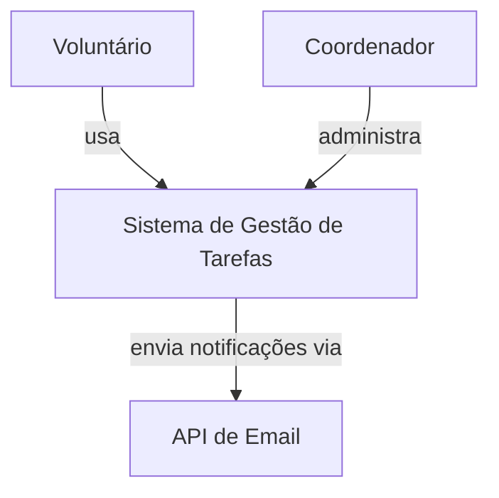

# Semana 4 — Terça-feira

## C4 Model: desenhando a arquitetura do nosso projeto

**CIN0136: Desenvolvimento de Software | CIn-UFPE | 2026.1** **23/03/2026 | E232 | 18:50–20:30**

---

## Leitura Prévia

📖 _Engenharia de Software em Dimensões_ — Cap. 14, seções 14.3.1 a 14.3.3 (Estrutura hierárquica do C4) e seção 14.4 (C4 vs UML)

📖 _Engenharia de Software Moderna_ (Valente) — Cap. 7: Arquitetura (seções: Camadas; MVC)

**Traga para a aula:** um rascunho dos atores e blocos técnicos do projeto da sua equipe.

---

## Objetivos desta aula

Ao final desta aula, você deve ser capaz de:

- Explicar o que é o C4 Model e por que ele é útil para documentar arquitetura
- Desenhar diagramas de Contexto (Nível 1) e Contêiner (Nível 2) do seu projeto
- Justificar por que documentar a arquitetura importa mesmo quando ela pode mudar
- Usar Mermaid ou draw.io para criar diagramas que podem ser versionados no GitHub

---

## 1. Por que documentar a arquitetura?

> _"Por que documentamos a arquitetura se ela pode mudar?"_

Anote sua resposta antes da discussão:

```
Sua resposta inicial:


```

A resposta curta: **porque decisões esquecidas se repetem, e decisões mal comunicadas geram retrabalho.** Documentar a arquitetura não é criar um contrato imutável — é criar um mapa compartilhado que a equipe pode consultar e atualizar.

---

## 2. O C4 Model — 4 níveis de zoom

O C4 Model foi criado por Simon Brown como uma forma simples e prática de documentar a arquitetura de software. A ideia central é: **diferentes públicos precisam de diferentes níveis de detalhe.**

```
Nível 1: CONTEXTO      → Quem usa o sistema? Com que sistemas ele se conecta?
                            (público: stakeholder, qualquer pessoa)

Nível 2: CONTÊINER      → Quais são os grandes blocos técnicos?
                            (público: equipe de desenvolvimento)

Nível 3: COMPONENTE     → Dentro de cada contêiner, quais são os módulos?
                            (público: desenvolvedores do módulo)

Nível 4: CÓDIGO         → Classes, funções, detalhes de implementação
                            (raramente documentado — o código é a documentação)
```

Para o nosso projeto, vamos focar nos **Níveis 1, 2 e 3**.

---

## 3. Nível 1 — Diagrama de Contexto

O diagrama de contexto responde: **quem interage com o nosso sistema e com o que ele se conecta?**

### Exemplo: Sistema de Gestão de Tarefas para uma ONG

```
┌─────────────┐        ┌───────────────────────┐        ┌─────────────────┐
│  Voluntário │───────→│   Sistema de Gestão   │←───────│  Coordenador    │
│  (usuário)  │        │     de Tarefas        │        │  da ONG         │
└─────────────┘        └───────────┬───────────┘        └─────────────────┘
                                   │
                                   ↓
                       ┌───────────────────────┐
                       │  Serviço de e-mail    │
                       │  (API externa)        │
                       └───────────────────────┘
```

**Elementos do Nível 1:**
- **Pessoas** (atores que usam o sistema) — em caixas com formato distinto
- **O sistema** (o que estamos construindo) — caixa central
- **Sistemas externos** (APIs, serviços de terceiros) — caixas com indicação "externo"

### Rascunhe o Nível 1 do seu projeto

```
[Desenhe aqui os atores e conexões do seu sistema]


```

---

## 4. Nível 2 — Diagrama de Contêiner

O diagrama de contêiner responde: **de que blocos técnicos o sistema é feito?**

Um "contêiner" no C4 é qualquer coisa que precisa estar rodando para o sistema funcionar: uma aplicação web, uma API, um banco de dados, um servidor de arquivos.

### Exemplo: mesmo sistema, agora com contêineres

```
┌──────────────────────────────────────────────────────────┐
│                  Sistema de Gestão de Tarefas              │
│                                                            │
│  ┌──────────────┐    ┌──────────────┐    ┌──────────────┐ │
│  │  Frontend     │    │  Backend API  │    │  Banco de    │ │
│  │  (React/Vite) │───→│  (Node.js/   │───→│  Dados       │ │
│  │               │    │   Express)   │    │  (SQLite)    │ │
│  └──────────────┘    └──────┬───────┘    └──────────────┘ │
│                              │                              │
└──────────────────────────────┼──────────────────────────────┘
                               ↓
                    ┌──────────────────┐
                    │  Serviço de      │
                    │  e-mail externo  │
                    └──────────────────┘
```

**Elementos do Nível 2:**
- **Contêineres** (frontend, backend, banco, etc.) — com tecnologia indicada
- **Setas** — indicam comunicação (HTTP, SQL, etc.)
- **Sistemas externos** — fora da caixa do sistema

### Rascunhe o Nível 2 do seu projeto

```
[Desenhe aqui os contêineres do seu sistema]


```

---

## 5. Nível 3 — Diagrama de Componentes

O diagrama de componentes responde: **dentro de cada contêiner, quais são os módulos?**

### Exemplo: componentes do Backend API

```
┌────────────────────────────────────────────────┐
│              Backend API (Node.js/Express)       │
│                                                  │
│  ┌──────────┐  ┌──────────┐  ┌──────────────┐  │
│  │  Routes   │→│Controllers│→│  Services     │  │
│  │           │  │           │  │  (lógica de  │  │
│  │           │  │           │  │   negócio)   │  │
│  └──────────┘  └──────────┘  └──────┬───────┘  │
│                                      ↓          │
│                              ┌──────────────┐   │
│                              │ Repositories  │   │
│                              │ (acesso a DB) │   │
│                              └──────────────┘   │
└────────────────────────────────────────────────┘
```

Repare como os componentes do Nível 3 correspondem diretamente às pastas que discutimos ontem: routes, controllers, services, repositories.

---

## 6. C4 vs UML — quando usar o quê?

|Aspecto|C4 Model|UML|
|---|---|---|
|**Público-alvo**|Qualquer pessoa (do stakeholder ao dev)|Principalmente desenvolvedores|
|**Curva de aprendizado**|Baixa — 4 tipos de diagramas intuitivos|Alta — 14 tipos de diagramas com notação formal|
|**Foco**|Comunicação e decisão|Especificação e precisão|
|**Para o nosso projeto**|✅ Ideal|Desnecessário neste momento|

> O C4 não substitui a UML — ele resolve um problema diferente. Quando você precisa comunicar arquitetura para alguém que não é técnico (como o stakeholder), o C4 é mais eficaz. Quando você precisa especificação técnica detalhada, a UML tem mais rigor.

---

## 7. Ferramentas para criar diagramas C4

### Mermaid (recomendado — integra com GitHub)

Mermaid permite criar diagramas como código, versionáveis no repositório:



Vantagem: o diagrama mora no repositório junto com o código. Quando a arquitetura muda, o diagrama pode ser atualizado no mesmo PR.

### draw.io (alternativa visual)

Para quem prefere arrastar e soltar. Gera arquivos `.drawio` que podem ser comitados no repositório. O GitHub renderiza nativamente.

---

## 8. Questão estruturante para reflexão

> _"Considerando que a arquitetura de um software evolui ao longo do desenvolvimento, qual é o valor de documentá-la desde o início do projeto?"_

```
Sua resposta:


```

---

## 9. Para a próxima aula (Quinta-feira)

📖 **Não há leitura prévia** — a quinta-feira é prática.

**Na quinta você vai:**

- **Bloco 1 (2h) — Workshop de Arquitetura:** desenhar os diagramas C4 reais do projeto da sua equipe (Níveis 1, 2 e 3), definir a estrutura de pastas e documentar decisões arquiteturais
- **Bloco 2 (2h) — Início do desenvolvimento:** implementar o scaffold no repositório, dividir features do Sprint 1, começar pair programming e abrir os primeiros PRs

**Prepare-se:**

- Revise o backlog do projeto — quais features são prioridade para o Sprint 1?
- Traga o rascunho de Nível 1 e Nível 2 que você fez nesta aula
- Certifique-se de que tem o repositório clonado e o ambiente de desenvolvimento funcionando

---

## Espaço para anotações da aula

```
[Use este espaço livremente durante a aula]


```

---

_CIN0136 — Desenvolvimento de Software | CIn-UFPE | 2026.1_ _Referências: Garcia, V. C. Engenharia de Software em Dimensões. ASSERT Lab, 2025. Cap. 14, seções 14.3.1–14.3.3 e 14.4._ _Valente, M. T. Engenharia de Software Moderna. 2022. Cap. 7._
