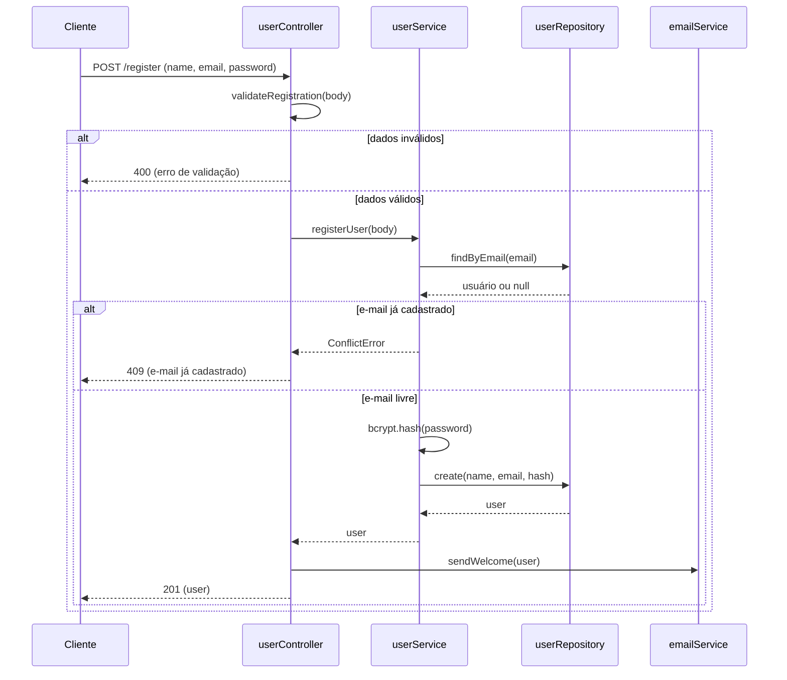
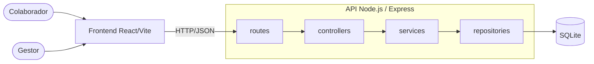

# Semana 6 — Terça-feira

## O que são APIs + Princípios de design de software

**CIN0136: Desenvolvimento de Software | CIn-UFPE |** **E132 | 17:00–18:40**

---

## Leitura Prévia

📖 _Engenharia de Software em Dimensões_ — Cap. 14, seções 14.1.1–14.1.2 (continuação da segunda)

📖 _Engenharia de Software Moderna_ — Cap. 5 (Princípios de Projeto: Integridade Conceitual, Ocultamento de Informação, Coesão, Acoplamento)

Se você não leu, tudo bem — mas traga dois trechos do código do projeto: um que você acha bem organizado, outro que te incomoda sem saber exatamente por quê.

---

## Objetivos desta aula

Ao final desta aula, você deve ser capaz de:

- Definir API como contrato documentado entre componentes de um sistema
- Descrever a anatomia de uma API Express (rota → controller → resposta)
- Identificar coesão alta e acoplamento baixo como propriedades desejáveis no código
- Aplicar os princípios de separação de responsabilidades e nomes significativos em código JavaScript
- Reconhecer, no código do seu próprio projeto, pelo menos uma violação de design e propor uma refatoração
- Ler um diagrama de sequência simples (`POST /register`) e relacionar cada seta a uma fronteira de responsabilidade
- Registrar uma decisão de arquitetura em um ADR (formato Nygard), usando o Compasso como exemplo

---

## 1. Uma pergunta antes de começar

> _"Se você fosse embora amanhã e outra pessoa tivesse que continuar o seu código, o que ela precisaria saber que não está escrito em nenhum lugar?"_

```
Sua resposta:


```

---

## 2. O que é uma API?

Uma **API (Application Programming Interface)** é um contrato documentado entre duas partes: quem quer usar um serviço (o chamador) e quem fornece esse serviço (o chamado).

O contrato especifica:

| Pergunta | No contexto de uma API HTTP |
|----------|---------------------------|
| Como localizar a função? | Endpoint URI + método HTTP |
| Como passar argumentos? | Query params (GET) ou corpo JSON (POST/PUT) |
| Como receber o resultado? | Corpo da resposta (JSON) |
| O que acontece em caso de erro? | Status code + mensagem de erro estruturada |

### 2.1 Anatomia de uma chamada de API real

```
GET https://api.seusite.com/v1/pets?status=available&api_key=...
│   │                       │  │                   │
│   └─ scheme + hostname    │  └─ operação          └─ parâmetros
│                           └─ versão da API
└─ método HTTP
```

A resposta típica em JSON:

```json
{
  "data": [
    { "id": 1, "name": "Rex", "species": "dog", "status": "available" },
    { "id": 2, "name": "Luna", "species": "cat", "status": "available" }
  ],
  "total": 2,
  "page": 1
}
```

### 2.2 API Express na prática

No Express, uma API é composta por três elementos que devem ter responsabilidades bem separadas:

```javascript
// routes/petRoutes.js — só sabe QUAIS URLs existem
router.get('/pets', petController.listAll);
router.post('/pets', petController.create);
router.get('/pets/:id', petController.findById);

// controllers/petController.js — recebe requisição, delega, responde
async function listAll(req, res) {
  const pets = await petService.getAvailablePets();
  res.json({ data: pets });
}

// services/petService.js — contém a lógica de negócio
async function getAvailablePets() {
  return petRepository.findByStatus('available');
}
```

**Pergunta:** Onde está a lógica de "só retornar pets disponíveis" neste código? Por que ela está lá e não no controller?

```
Sua resposta:


```

---

## 3. O exercício dos dois códigos

Os dois trechos abaixo fazem exatamente a mesma coisa: **cadastrar um usuário e enviar um e-mail de boas-vindas**. Leia os dois em silêncio por 3 minutos.

### Versão A — Tudo junto

```javascript
// app.js (ou routes/index.js)
app.post('/register', async (req, res) => {
  const { name, email, password } = req.body;
  if (!name || !email || !password)
    return res.status(400).json({ error: 'Campos obrigatórios' });
  if (password.length < 8)
    return res.status(400).json({ error: 'Senha fraca' });

  const existing = await db.query(
    'SELECT * FROM users WHERE email = $1', [email]
  );
  if (existing.rows.length > 0)
    return res.status(409).json({ error: 'Email já cadastrado' });

  const hash = await bcrypt.hash(password, 10);
  const result = await db.query(
    'INSERT INTO users (name, email, password) VALUES ($1, $2, $3) RETURNING id',
    [name, email, hash]
  );
  const userId = result.rows[0].id;

  await transporter.sendMail({
    from: 'noreply@app.com',
    to: email,
    subject: 'Bem-vindo!',
    html: `<h1>Olá ${name}!</h1><p>Sua conta foi criada.</p>`
  });

  res.status(201).json({ id: userId, name, email });
});
```

### Versão B — Responsabilidades separadas

```javascript
// validators/userValidator.js
function validateRegistration({ name, email, password }) {
  if (!name || !email || !password) return 'Campos obrigatórios';
  if (password.length < 8) return 'Senha fraca';
  return null;
}

// services/userService.js
async function registerUser({ name, email, password }) {
  const exists = await userRepository.findByEmail(email);
  if (exists) throw new ConflictError('Email já cadastrado');
  const hash = await bcrypt.hash(password, 10);
  return userRepository.create({ name, email, password: hash });
}

// services/emailService.js
async function sendWelcome(user) {
  await transporter.sendMail({
    from: 'noreply@app.com',
    to: user.email,
    subject: 'Bem-vindo!',
    html: templates.welcome(user)
  });
}

// controllers/userController.js
app.post('/register', async (req, res) => {
  const error = validateRegistration(req.body);
  if (error) return res.status(400).json({ error });
  const user = await registerUser(req.body);
  await sendWelcome(user);
  res.status(201).json(user);
});
```

**Agora responda:**

```
1. Você precisa mudar o template do e-mail de boas-vindas.
   Em qual versão faria isso com mais confiança? Por quê?


2. Dois colegas trabalham ao mesmo tempo: um adiciona validação
   de CPF, outro atualiza o e-mail. O que acontece em cada versão?


3. Na Versão A, quantas "razões para mudar" esse arquivo tem?
   Liste-as:


```

---

## 4. Os quatro princípios de design

O que você acabou de sentir ao comparar os dois códigos tem nome. Vamos nomear.

### Princípio 1 — Separação de Responsabilidades (SoC)

> **Cada parte do código deve ter uma única razão para existir.**

Uma função que valida dados, acessa banco e envia e-mail tem **três razões para mudar**. Qualquer mudança em uma delas pode quebrar as outras.

**Teste:** Se você não consegue descrever o propósito de um arquivo em uma frase curta, ele provavelmente mistura responsabilidades.

### O caminho de uma requisição: o diagrama de sequência

O desenho abaixo tem nome: **diagrama de sequência**. Ele mostra o caminho de uma requisição `POST /register` pelo código da **Versão B**. Cada seta atravessa uma fronteira de responsabilidade: o controller valida e responde, o service aplica a regra de negócio, o repository fala com o banco e o `emailService` envia o e-mail.



> 💡 O desenho é uma versão simplificada: `validateRegistration` vive em `userValidator.js` (aparece aqui como chamada do controller), e o código mostrado não converte o `ConflictError` em 409; o desenho assume um tratamento de erro que faz essa conversão.

**Exercício:** siga com o dedo o caminho do erro **409**. Quais participantes foram acionados? Quais **não** foram?

```
Sua resposta:


```

Você vai rever esse tipo de diagrama quando as camadas virarem componentes no C4.

### Princípio 2 — Coesão

> **Tudo dentro de um módulo deve falar sobre o mesmo assunto.**

```javascript
// ✗ Baixa coesão — userService.js com função de e-mail
async function registerUser(...) { ... }
async function sendWelcomeEmail(...) { ... }  // Por que está aqui?

// ✓ Alta coesão — cada arquivo tem um assunto
// userService.js → lógica de usuário
// emailService.js → lógica de e-mail
```

**Perguntas de diagnóstico:**
- Se eu abrir `petService.js`, o que esperaria encontrar?
- Se encontrar uma query SQL crua dentro de um controller, o que isso indica?

### Princípio 3 — Acoplamento

> **Conheça apenas a interface — nunca os detalhes internos de outra parte.**

Acoplamento é o oposto de independência. Quanto mais uma parte do sistema precisa saber sobre como outra parte funciona internamente, maior o acoplamento — e mais frágil o sistema fica.

```javascript
// ✗ Alto acoplamento — controller acessa o banco diretamente
async function listPets(req, res) {
  const result = await db.query('SELECT * FROM pets WHERE status = $1', ['available']);
  res.json(result.rows);
}

// ✓ Baixo acoplamento — controller conhece apenas a interface do service
async function listPets(req, res) {
  const pets = await petService.getAvailablePets();
  res.json(pets);
}
// (Se o banco mudar, só petService/petRepository mudam — o controller não sabe)
```

**Regra prática:** Cada camada deve conhecer apenas a interface da camada imediatamente abaixo, nunca os detalhes internos.

### Princípio 4 — Nomes Significativos

> **O código que se explica não precisa de comentário.**

```javascript
// ✗ Versão que exige decifração
const d = new Date();
const x = d.getTime() - t;
if (x > 86400000) { logout(); }

// ✓ Versão que se lê como prosa
const now = new Date();
const elapsedMs = now.getTime() - sessionStartTime;
const oneDayInMs = 24 * 60 * 60 * 1000;
if (elapsedMs > oneDayInMs) { logoutDueToInactivity(); }
```

Na versão ruim, você precisa rastrear mentalmente o que `t` representa, calcular o que `86400000` significa, e deduzir por que a condição existe. Na versão boa, o código se explica para qualquer colega que nunca viu este arquivo.

---

## 5. Estrutura de pastas como arquitetura visível

A estrutura de pastas de um projeto é a arquitetura tornada visível. Ela deve comunicar as responsabilidades de cada parte:

```
backend/
└── src/
    ├── routes/          ← O Express aprende que /api/pets existe. Só isso.
    ├── controllers/     ← Recebem requisição, delegam ao service, montam resposta
    ├── services/        ← A lógica de negócio — a parte mais valiosa
    ├── repositories/    ← Falam com o banco. Trocar banco = só aqui muda
    └── utils/           ← Funções auxiliares sem estado

frontend/
└── src/
    ├── pages/           ← Telas completas da aplicação
    ├── components/      ← Blocos reutilizáveis de UI
    ├── hooks/           ← Lógica de estado e efeitos (React)
    └── services/        ← Chamadas à API do backend

docs/
├── diagramas C4/        ← Contexto, Contêiner e Componente (em Mermaid)
├── ADRs/                ← ADR-001.md, ADR-002.md ... (uma decisão por arquivo)
└── README.md
```

A pasta `docs/` não é opcional. É onde a equipe registra **por que** tomou as decisões de arquitetura, não só o quê.

---

## 6. O Compasso: nosso sistema de referência

Nas próximas aulas, usaremos um sistema de exemplo, o **Compasso**, para mostrar diagramas, ADRs e decisões de arquitetura. A estrutura dele é a mesma que a do seu projeto: routes, controllers, services, repositories.

| | |
|---|---|
| **O que é** | Plataforma de time tracking: horas trabalhadas por projeto |
| **Atores** | O **Colaborador** registra horas. O **Gestor** aprova e vê relatórios por projeto |
| **Stack** | React/Vite + Node.js/Express + SQLite |
| **Rota central** | `POST /time-entry` (o colaborador registra uma entrada de horas) |



> ⚠️ Não confunda `POST /time-entry` (Compasso) com `POST /register`, que pertence ao exercício dos dois códigos.

---

## 7. ADR: registrando o porquê das decisões

Um **ADR (Architecture Decision Record)** é um pequeno documento que registra uma decisão de arquitetura. **O código só mostra o quê; o ADR registra o porquê.** Usamos o **formato Nygard**: um título e quatro seções, em um arquivo versionado junto com o código (`docs/ADR-00X.md`).

```
# ADR-00X: [Título da decisão]

## Status
Proposto, aceito ou substituído?

## Contexto
Que situação nos obriga a decidir?

## Decisão
O que vamos fazer, e por quê?

## Consequências
O que fica mais fácil e mais difícil?
```

### Exemplo: ADR-001 do Compasso

```
# ADR-001: Usar SQLite como banco de dados

## Status
Aceito

## Contexto
O Compasso é um sistema de time tracking desenvolvido em 4 semanas por uma
equipe de 4 pessoas. Não temos infraestrutura de servidor, e o volume de
registros é baixo e previsível.

## Decisão
Vamos usar SQLite, porque ele roda embutido na aplicação, sem servidor de
banco para instalar ou administrar.

## Consequências
Mais fácil: setup imediato, sem servidor de banco para administrar.
Mais difícil: não escala para produção com múltiplos projetos. Aceitamos esse
limite para este contexto.
```

Repare nas **Consequências**: registramos o que perdemos, não só o que ganhamos. E por que trocar de banco no futuro é viável? Porque só `repositories/` precisaria mudar (acoplamento e isolamento do banco, como na seção 4).

**Agora com o seu projeto:** escolha uma decisão que a equipe já tomou (banco de dados, estrutura de pastas, biblioteca de autenticação...) e escreva o ADR.

```
# ADR-001: ___________________________________

## Status


## Contexto


## Decisão


## Consequências
Mais fácil:
Mais difícil:
```

---

## 8. Diagnóstico do seu projeto

Usando os princípios desta aula, avalie o estado atual do código da equipe:

### 8.1 Código que você trouxe — o que incomoda?

```
Trecho que te incomoda:
(cole aqui ou descreva)


Por que incomoda? (tente nomear usando os princípios):


Como ficaria melhor?


```

### 8.2 Serviços que o projeto já tem (ou deveria ter)

Olhando para o backlog da equipe, quais serviços existem ou precisam existir?

| Nome do Service | Responsabilidade | Já existe no código? |
|----------------|-----------------|----------------------|
| | | |
| | | |
| | | |
| | | |

---

## 9. Questão estruturante

> _"Como a organização interna de um sistema influencia a capacidade de uma equipe de mantê-lo e evoluí-lo ao longo do tempo?"_

Reserve 2 minutos para reflexão individual antes da discussão:

```
Sua reflexão:


```

---

## 10. Para as próximas aulas

**Lab de quinta (Workshop de Arquitetura):** vamos mapear a arquitetura do projeto nas 3 camadas, identificar violações dos princípios de hoje e registrar as decisões da equipe em ADRs na pasta `docs/`. Venha com o repositório aberto.

📖 **Leitura para a Semana 7:** Cap. 14, seções 14.3.1–14.3.3 (C4 Model) e seção 14.4 (C4 vs UML). Traga um esboço mental dos atores externos e blocos técnicos do projeto.

---

## Espaço para anotações da aula

```
[Use este espaço livremente durante a aula]


```

---

_CIN0136 — Desenvolvimento de Software | CIn-UFPE_
_Referências: Garcia, V. C. Engenharia de Software em Dimensões. ASSERT Lab, 2025. Cap. 14. | Valente, M. T. Engenharia de Software Moderna, 2020. Cap. 5._
