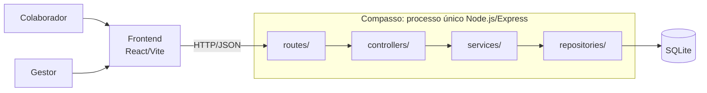
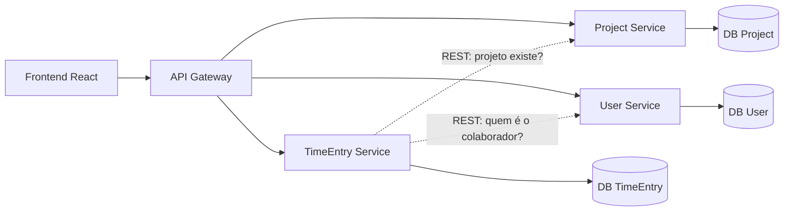
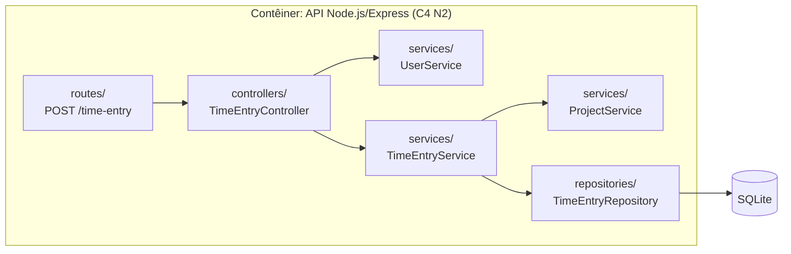

# Semana 7 — Segunda-feira

## Estilos Arquiteturais: como as grandes decisões moldam o sistema

**CIN0136: Desenvolvimento de Software | CIn-UFPE |** **E132 | 18:50–20:30**

---

## Leitura Prévia

📖 _Engenharia de Software em Dimensões_ — Cap. 14, seções 14.3–14.5
(Estilos arquiteturais monolíticos e distribuídos; trade-offs; escolha arquitetural)

📖 _Engenharia de Software Moderna_ — Cap. 7, seções sobre Arquitetura em Camadas, MVC, Microsserviços e trade-offs arquiteturais

Se você não leu antes de vir, não entre em pânico — mas leia antes da próxima aula.

---

## Objetivos desta aula

Ao final desta aula, você deve ser capaz de:

- Distinguir padrões fundamentais (Big Ball of Mud, Unitary, Client/Server) de estilos arquiteturais formais
- Descrever pelo menos três estilos arquiteturais (Camadas, SOA, Microsserviços) com suas forças e fraquezas
- Argumentar os trade-offs de monolito vs. distribuído para um contexto concreto
- Identificar qual estilo arquitetural descreve melhor o que a sua equipe está construindo
- Distinguir os três sentidos da palavra *service* (pasta `services/`, SOA, microsserviços)
- Registrar uma decisão de arquitetura em um ADR (formato Nygard) e relacionar a decisão ao porquê

---

## 1. Uma pergunta antes de começar

> _"Microsserviços são sempre uma escolha melhor do que um monolito?"_

Anote sua resposta instintiva agora — antes de qualquer discussão:

```
Sua posição inicial (sim / não / depende):


Por quê?


```

Você vai revisitar essa resposta no final da aula.

---

## 2. Padrões fundamentais: onde tudo começa

Antes de falar em estilos sofisticados, é preciso entender as estruturas mais básicas — inclusive as que devemos evitar.

### 2.1 Big Ball of Mud — o anti-padrão

O Big Ball of Mud não é uma escolha — é o que acontece quando não há escolha consciente. Código cresce sem planejamento, sem separação de responsabilidades, sem estrutura definida.

**Características:**
- Qualquer parte do sistema pode chamar qualquer outra
- Nenhuma camada ou módulo claramente definido
- Mudanças em um lugar quebram comportamentos inesperados em outro

**Quando surge:** pressão de entrega alta, sem planejamento arquitetural, equipes que cresceram sem parar para refatorar.

**Por que importa para o seu projeto:** é exatamente o que pode acontecer quando 4 pessoas codam em velocidade alta sem combinarem a estrutura antes. O diagrama C4 que vocês vão produzir na próxima aula é uma das ferramentas para evitar isso. Voltaremos a este anti-padrão no fechamento do arco.

```
Você já viu algo parecido com Big Ball of Mud em algum código que escreveu ou viu?
Descreva brevemente:


```

### 2.2 Unitary Architecture

Todo o código em um único processo. Lógica de negócio, interface e armazenamento de dados vivem juntos.

- **Quando faz sentido:** sistemas embarcados, scripts utilitários, protótipos de prova de conceito
- **Limitação central:** escalabilidade quase impossível

### 2.3 Client/Server

A separação mais fundamental da web moderna: cliente (responsável pela interface) e servidor (responsável pela lógica e dados), comunicando-se via rede.

- É a base de praticamente toda aplicação web — incluindo o que vocês estão construindo
- O React no front-end é o cliente; o Express no back-end é o servidor

**Complete a tabela abaixo:**

| Padrão | Característica central | Quando usar | Risco principal |
|--------|----------------------|-------------|-----------------|
| Big Ball of Mud | | | |
| Unitary | | | |
| Client/Server | | | |

---

## 3. Estilos arquiteturais formais

Estilos arquiteturais são estruturas reconhecíveis que encapsulam um conjunto de **trade-offs** bem conhecidos. Escolher um estilo é escolher conscientemente quais problemas você quer ter.

### 3.1 Arquitetura em Camadas (aprofundamento)

Você já trabalhou com isso na Semana 6: Apresentação → Negócio → Persistência. É o estilo da estrutura de pastas do Compasso (e do seu projeto): `routes` → `controllers` → `services` → `repositories`.

**O conceito-chave:** camadas fechadas vs. camadas abertas. Uma camada **fechada** exige que todas as requisições passem por ela. Uma camada **aberta** permite que uma requisição "pule" para a camada abaixo diretamente.

```
Camada de Apresentação  ──closed──►  só pode chamar ↓
Camada de Negócio       ──closed──►  só pode chamar ↓
Camada de Persistência  ──closed──►  só pode chamar ↓
Banco de Dados
```

**Por que fechadas são geralmente melhores?** Porque violações de camada são a semente do Big Ball of Mud. Um controller que acessa diretamente o banco de dados está criando um atalho que vira dependência que vira problema.

**Forças:** organização clara, facilidade de manutenção, testabilidade por camada
**Fraquezas:** latência em cada chamada, escalabilidade horizontal difícil, risco de camadas "passthrough" sem lógica real

```
No projeto da sua equipe: qual camada tem mais lógica do que deveria?
Qual tem menos?


```

### 3.2 Arquitetura Orientada a Serviços (SOA)

SOA organiza o sistema em **serviços independentes** coordenados por um orquestrador central — tipicamente um Enterprise Service Bus (ESB).

**Ideia central:** um componente central conhece o fluxo e chama os serviços na ordem certa.

```
          ┌─────────────────┐
          │  Orquestrador   │  ← o ESB conhece o fluxo
          └────┬────┬───────┘
               │    │
        ┌──────┘    └──────┐
        ▼                  ▼
   [Serviço A]        [Serviço B]
```

**Forças:** fluxo de processo bem definido, rastreabilidade, integração entre sistemas legados
**Fraquezas:** ponto único de falha (o orquestrador), acoplamento centralizado, gargalo de escalabilidade

**Diferença importante:** SOA é comum em sistemas corporativos com serviços granulares e regras de integração complexas — diferente de microsserviços, onde cada serviço é autônomo.

### Pausa de vocabulário: mesma palavra, significados diferentes

A palavra **service** já apareceu em três sentidos, e *component* e *contêiner* vão confundir você na próxima aula.

| Palavra | Contexto | O que significa |
|---------|----------|-----------------|
| **service** | Pasta `services/` do Compasso | Camada de lógica de negócio dentro do monolito (ex.: `TimeEntryService`) |
| | SOA | Unidade autônoma do sistema, orquestrada por um ESB |
| | Microsserviços | Processo independente, com seu próprio banco de dados |
| **component** | React/Vite | Bloco de UI reutilizável |
| | C4 Nível 3 | Módulo dentro de um contêiner |
| **contêiner** | C4 Nível 2 | Qualquer processo em execução independente (ex.: a API Node.js) |
| | Docker/DevOps | Ambiente de execução isolado |

> Mesma palavra, outro mundo. Sempre pergunte: **em que contexto?**

```
Dê um exemplo de cada sentido de "service" no Compasso (ou no seu projeto):


```

### 3.3 Microsserviços

Uma aplicação composta por serviços **pequenos e autônomos**, cada um executando em seu próprio processo e comunicando-se via API (geralmente HTTP/REST ou mensageria).

**Princípio central:** cada microsserviço tem seu próprio banco de dados, sua própria equipe, seu próprio ciclo de deploy.

**Bounded Context (só a intuição, por ora):** cada serviço tem o seu próprio modelo e os seus próprios dados, e os serviços não compartilham estado diretamente: comunicam-se por APIs ou eventos. Exemplo: num e-commerce, o Serviço de Pedidos não acessa diretamente o banco do Serviço de Pagamentos. O conceito vem do Domain-Driven Design (DDD) e será aprofundado na **Semana 11**.

**Forças:** escalabilidade independente por serviço, times autônomos, deploy isolado, tecnologias heterogêneas
**Fraquezas:** complexidade operacional enorme, consistência de dados distribuída difícil, latência de rede em cada chamada, debugging complexo

---

## 4. O grande debate: Monolito vs. Distribuído

| Dimensão | Monolito (Camadas) | Microsserviços |
|---|---|---|
| **Complexidade inicial** | Baixa | Alta |
| **Escalabilidade** | Escala o sistema todo | Escala serviços individualmente |
| **Deploy** | Um deploy, uma decisão | Deploy independente por serviço |
| **Debugging** | Uma stack trace | Rastrear entre serviços |
| **Consistência de dados** | Transações ACID | Eventual consistency |
| **Tamanho de equipe ideal** | Pequena a média | Grande, times independentes |
| **Quando migrar?** | Quando os limites ficam claros | Nunca prematuramente |

> A Primeira Lei da Arquitetura de Software (Richards & Ford): **"Tudo na arquitetura de software é um trade-off."**

```
Se você tivesse que construir um sistema de reservas de biblioteca universitária
com uma equipe de 4 pessoas e prazo de 4 meses, qual estilo escolheria?

Sua escolha:

Por quê:

Que trade-off você está conscientemente aceitando:

```

### 4.1 O Compasso como monolito modular

Imagine que a equipe acabou de criar o **Compasso**, uma plataforma de time tracking. Depois das primeiras reuniões e do levantamento de requisitos, o backend Express nasce organizado em camadas: `routes` → `controllers` → `services` → `repositories`. O resultado é **um único processo** (um monolito modular) que atende o Colaborador e o Gestor: um deploy, um processo, um banco.



### 4.2 E se o Compasso fosse distribuído? (hipótese, não é o que vamos construir)

Cada área funcional vira um microsserviço próprio (TimeEntry, Project e User), cada um com o seu banco de dados. O frontend não fala direto com eles: passa por um **API Gateway**. Os mesmos módulos do monolito, agora como **três processos, três bancos e chamadas de rede**.



```
Pense no custo disso para 4 pessoas em 4 semanas. Que benefícios dos microsserviços
(times independentes, deploy isolado, tecnologias diferentes) a sua equipe realmente aproveitaria?


```

### 4.3 Como escolher: três fatores

| Fator | Pergunta |
|-------|----------|
| **Escalabilidade** | Como o sistema vai lidar com o aumento de usuários e dados? |
| **Manutenibilidade** | O sistema será fácil de modificar e corrigir? |
| **Requisitos de negócio** | Quais são as necessidades específicas do negócio (funcionalidade, desempenho, segurança)? |

### 4.4 Transições entre estilos

- **Migração gradual:** novos serviços entram em uma nova arquitetura enquanto a antiga continua funcionando. Transição suave, risco menor.
- **Migração *big bang*:** a arquitetura antiga é substituída de uma só vez. Mais rápida, mas com maior risco de falhas e interrupções.

As arquiteturas **não são estáticas**: evoluem ao longo de longos períodos, à medida que as tecnologias amadurecem, e também durante o curso normal de projetar um sistema.

---

## 5. ADR: registrando uma decisão de arquitetura

Escolhemos monolito modular para o Compasso. **Por quê?** A Segunda Lei da Arquitetura de Software (Richards & Ford) diz:

> **Por que é mais importante do que como.**

Um arquiteto consegue olhar um sistema e ver *como* ele é estruturado, mas dificilmente explica *por que* certas escolhas foram feitas. É para isso que serve o **ADR** (formato Nygard, visto na aula anterior): o Contexto e a Decisão registram o porquê.

```
# ADR-002: Usar monolito modular

## Status
Aceito

## Contexto
O Compasso será construído por uma equipe de 4 pessoas em um prazo de 4 semanas,
sem necessidade de escala horizontal.

## Decisão
Vamos construir um monolito modular (Node.js/Express com camadas separadas:
routes, controllers, services e repositories), porque a equipe é pequena e o
prazo é curto.

## Consequências
Mais fácil: um único deploy, simples de desenvolver e testar.
Mais difícil: migrar para microsserviços no futuro será custoso. Aceitamos esse
custo para este contexto.
```

Repare nas Consequências: um ADR bom registra o que a decisão **custa**, não só o que ela ganha. E se o contexto mudar, a decisão pode ser revista: o ADR não é apagado, ganha o status *"substituído por ADR-00X"*, e o histórico do porquê fica preservado. Se um dia migrarmos, a migração gradual (4.4) reduz o risco.

**Agora com o seu projeto:**

```
Que decisão arquitetural do seu projeto vale um ADR?

Contexto (que forças pesam?):

Decisão (o que e por quê):

Consequências: mais fácil / mais difícil:

```

---

## 6. Da conversa escrita à conversa visual: o C4

O ADR registra o **porquê** das decisões. O **C4 Model** desenha o **quê** e como as partes se conectam: é a mesma conversa, em forma visual.

### 6.1 Suas pastas já são um diagrama C4

A estrutura de pastas que você já usa no backend é, na prática, o que o C4 chama de **nível 3**. Na próxima aula, cada bloco ganha nome e nível.



- **Contêiner · C4 N2:** a API Node.js/Express inteira, um processo em execução (a caixa externa).
- **Componentes · C4 N3:** cada módulo das pastas (controller, service, repository), como `TimeEntryService` (as caixas internas).

### 6.2 Quatro zooms sobre o mesmo sistema

| Nível | Nome | Pergunta |
|-------|------|----------|
| N1 | Contexto | Quem usa o sistema e com quais outros sistemas ele conversa? |
| N2 | Contêineres | Quais processos em execução compõem o sistema? |
| N3 | Componentes | Quais módulos existem dentro de um contêiner? |
| N4 | Código | Como um componente é implementado (classes, funções)? |

Foque em N1, N2 e N3; o N4 é só mencionado. E cuidado com o vocabulário: **contêiner não é Docker** e **componente não é React** (veja a tabela de vocabulário acima).

---

## 7. Qual estilo descreve o projeto da sua equipe?

O objetivo desta seção é conectar o conteúdo ao seu projeto real.

**Passo 1 — Descreva o que vocês têm hoje:**

```
Nome do projeto:

Qual é a divisão atual do código (pastas, repositórios, processos)?


```

**Passo 2 — Classifique:**

| Critério | Resposta |
|---|---|
| Existe separação frontend/backend? | Sim / Não |
| O backend tem camadas separadas? | Sim / Não / Parcialmente |
| Existem serviços independentes? | Sim / Não |
| Há um banco de dados por serviço? | N/A (temos um único BD) |

**Passo 3 — Nomeie:**

```
O estilo que melhor descreve nossa arquitetura atual é:


O estilo que gostaríamos de ter (se diferente):


Por que não chegamos lá ainda:


```

---

## 8. Questão estruturante para reflexão

> _"Se um arquiteto de software não pode justificar por que tomou uma decisão arquitetural, essa decisão é um risco — não uma escolha. Qual decisão arquitetural o seu projeto tomou que você consegue justificar claramente? Qual não consegue?"_

Esta não tem resposta certa. É uma pergunta para levar para a reunião de equipe.

---

## 9. Para a próxima aula

📖 **Leitura obrigatória:** Garcia, Cap. 14, seções 14.3.1–14.3.3 (Estrutura hierárquica do C4 Model) e seção 14.4 (C4 vs UML)

📖 **Complementar:** Valente, Cap. 7 — seções sobre Camadas e MVC (como base para entender o Nível 3 do C4)

**Traga para a aula:** um esboço (pode ser à mão, numa foto) do que seria o Nível 1 do C4 do seu projeto — quem são os atores e o que o sistema faz. Não precisa ser perfeito.

---

## Espaço para anotações da aula

```
[Use este espaço livremente durante a aula]


```

---

_CIN0136 — Desenvolvimento de Software | CIn-UFPE1_
_Referências: Garcia, V. C. Engenharia de Software em Dimensões. ASSERT Lab, 2025. Cap. 14, seções 14.3–14.5. Valente, M. T. Engenharia de Software Moderna. Cap. 7._
