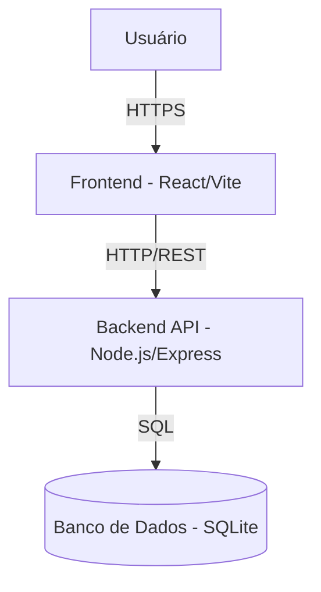

# Semana 7 — Terça-feira

## C4 Model: desenhando a arquitetura do projeto real

**CIN0136: Desenvolvimento de Software | CIn-UFPE | 2026.1**
**28/04/2026 | E132 | 17:00–18:40**

> ⚠️ Aula deslocada: feriado de Tiradentes (21/04). Ocorre em 28/04.

---

## Leitura Prévia

📖 _Engenharia de Software em Dimensões_ — Cap. 14, seções 14.3.1–14.3.3 (Estrutura hierárquica do C4: Contexto, Contêiner, Componente) e seção 14.4 (C4 vs. UML)

📖 _Engenharia de Software Moderna_ — Cap. 7, seções sobre Camadas e MVC (base conceitual para o Nível 3 do C4)

**Antes de entrar na aula:** traga um esboço (pode ser foto de papel) do que seria o Diagrama de Contexto (Nível 1) do seu projeto. Quem usa o sistema? Com o que ele se conecta?

---

## Objetivos desta aula

Ao final desta aula, você deve ser capaz de:

- Explicar os quatro níveis do C4 Model e o que cada um responde
- Criar um Diagrama de Contexto (N1) para o seu projeto
- Criar um Diagrama de Contêiner (N2) para o seu projeto com tecnologias explícitas
- Esboçar um Diagrama de Componente (N3) para o back-end do seu projeto
- Escolher entre Mermaid e draw.io para manter os diagramas vivos no repositório

---

## 1. Uma pergunta antes de começar

> _"Por que documentaríamos a arquitetura se ela vai mudar de qualquer forma?"_

Anote sua resposta agora:

```
Sua resposta inicial:


```

---

## 2. O problema que o C4 resolve

Imagine dois membros da sua equipe começando a codar ao mesmo tempo, sem combinar a estrutura antes. Um cria o back-end em `server/`, o outro em `api/`. No primeiro dia já há conflito de estrutura.

A documentação arquitetural não existe para fixar decisões — existe para **criar um mapa compartilhado** que a equipe pode consultar e atualizar. O mapa muda conforme o sistema cresce. Mas sem mapa, ninguém sabe onde está nem para onde ir.

> _"Decisões esquecidas se repetem. Decisões mal comunicadas geram retrabalho."_

O C4 Model resolve isso com simplicidade: **quatro níveis progressivos de zoom**, cada um respondendo uma pergunta diferente.

---

## 3. Os quatro níveis do C4

| Nível | Nome | Pergunta central | Para quem |
|-------|------|-----------------|-----------|
| 1 | Contexto | Quem usa o sistema e com o que ele se conecta? | Qualquer pessoa |
| 2 | Contêiner | Quais são os grandes blocos técnicos? | Time de desenvolvimento |
| 3 | Componente | O que há dentro de cada bloco? | Desenvolvedores |
| 4 | Código | Como as classes se relacionam? | Raramente documentado |

**Regra prática para o seu projeto:** Níveis 1, 2 e 3 são suficientes. O Nível 4 é o código em si — se o código precisar de um diagrama para ser entendido, o problema provavelmente é o código, não a falta de diagrama.

---

## 4. Nível 1 — Diagrama de Contexto

**Pergunta:** quem usa o sistema e com o que ele se conecta?

**O que aparece:**
- Usuários (pessoas com nome e papel)
- O seu sistema (uma única caixa — sem detalhe técnico)
- Sistemas externos com os quais ele se integra

**O que NÃO aparece:** tecnologia, banco de dados, linguagem de programação, estrutura de pastas.

Este é o diagrama que você mostra ao **parceiro na Sprint Review**. Qualquer pessoa deve conseguir entender sem saber programar.

### Exemplo: Sistema de Gestão de Tarefas para ONG

```
[Voluntário] ──usa──► [Sistema de Gestão de Tarefas] ◄──usa── [Coordenador]
                                    │
                                    └──envia via── [API de E-mail (externo)]
```

**Agora faça para o SEU projeto:**

```
Atores do seu sistema (quem usa? com que papel?):
1.
2.
3. (se houver)

Sistemas externos integrados (APIs, serviços de terceiros):
1.
2. (se houver)
```

**Esboço do seu Diagrama de Contexto (N1):**

```
[Use este espaço para rascunhar — pode ser só texto ou uma figura simples]


```

---

## 5. Nível 2 — Diagrama de Contêiner

**Pergunta:** quais são os grandes blocos técnicos e como eles se comunicam?

**O que aparece:**
- Cada processo separado em execução (aplicação web, API, banco de dados, worker)
- A tecnologia de cada um (React/Vite, Node.js/Express, SQLite, etc.)
- A forma de comunicação entre eles (HTTP/REST, JDBC, etc.)

**Regra de ouro:** sempre indique a tecnologia. "Backend" não é suficiente — "Backend API (Node.js/Express)" é.

### Exemplo: o mesmo sistema de tarefas

```
[Coordenador] ──HTTPS──► [Frontend (React/Vite)]
[Voluntário]  ──HTTPS──► [Frontend (React/Vite)]
                                  │
                              HTTP/REST
                                  │
                                  ▼
                        [Backend API (Node.js/Express)]
                                  │
                          leitura e escrita
                                  │
                                  ▼
                        [Banco de Dados (SQLite)]

                        [Backend API] ──SMTP──► [API de E-mail (externo)]
```

**Agora faça para o SEU projeto:**

```
Contêineres do seu sistema:

Nome do contêiner 1:          Tecnologia:
Nome do contêiner 2:          Tecnologia:
Nome do contêiner 3:          Tecnologia:
Nome do contêiner 4 (se houver): Tecnologia:

Como eles se comunicam?
Contêiner 1 → Contêiner 2 via:
Contêiner 2 → Contêiner 3 via:
```

**Esboço do Diagrama de Contêiner (N2):**

```
[Rascunhe aqui]


```

---

## 6. Nível 3 — Diagrama de Componente

**Pergunta:** o que há dentro de um contêiner específico?

Normalmente escolhemos o **back-end** para detalhar no N3, porque é onde a lógica de negócio vive. E os componentes que aparecem aqui são exatamente as **pastas** que você implementou:

```
[Rota] ──recebe HTTP──► [Controller] ──orquestra──► [Service] ──acessa──► [Repository] ──► [BD]
```

**Este nível conecta diretamente com a discussão da Semana 6:** a separação em camadas que vocês definiram na arquitetura vira componentes no C4 N3.

**Dica:** se a estrutura de pastas do seu projeto reflete o diagrama de componentes, você já tem metade da documentação feita.

**Para o seu projeto — dentro do back-end:**

```
Componentes que existem:

Nome do componente:        Responsabilidade:
                          
Nome do componente:        Responsabilidade:
                          
Nome do componente:        Responsabilidade:
                          
Nome do componente:        Responsabilidade:
```

**Uma pergunta difícil:**

```
Existe alguma responsabilidade no seu back-end que não está claramente
alocada a nenhum componente? O que você faria com ela?


```

---

## 7. Ferramentas: Mermaid vs. draw.io

### Mermaid

Diagramas escritos como texto — integra diretamente com o GitHub Markdown.



**Vantagem:** vive no repositório, versiona junto com o código, qualquer PR pode atualizar o diagrama.
**Desvantagem:** layout automático nem sempre fica bonito.

### draw.io

Interface gráfica drag-and-drop. Exporta SVG ou PNG para o repositório.

**Vantagem:** mais controle visual, diagramas mais bonitos para apresentar ao stakeholder.
**Desvantagem:** o arquivo `.drawio` não é legível como texto — versionar mudanças é opaco.

**Recomendação para o projeto:**

| Nível | Ferramenta sugerida | Por quê |
|-------|--------------------|---------| 
| N1 (Contexto) | draw.io ou Mermaid | Mostrado ao parceiro — visual importa |
| N2 (Contêiner) | Mermaid | Versiona bem, fácil de manter |
| N3 (Componente) | Mermaid | Atualiza junto com o código |

---

## 8. C4 vs. UML — por que C4 para este projeto?

| Critério | C4 Model | UML |
|---------|---------|-----|
| Quantidade de diagramas | 4 níveis | 14 tipos |
| Curva de aprendizado | Baixa | Alta |
| Legibilidade para não-técnicos | Alta | Baixa |
| Adequado para times ágeis | Sim | Com ressalvas |
| Ferramentas | Mermaid, draw.io | Enterprise Architect, Astah |

Para o nosso contexto — projeto iterativo, equipe pequena, arquitetura em evolução — **C4 é a escolha certa**. UML faz sentido em projetos com requisitos estáveis que exigem especificação técnica precisa.

---

## 9. Reflexão: a arquitetura que vocês planejaram vs. a que vocês têm

Na Sprint Week, vocês codaram sob pressão. Talvez algumas decisões arquiteturais foram feitas no momento, sem discussão.

Responda:

```
1. A estrutura de pastas do projeto está refletindo a arquitetura em camadas
   planejada na Semana 6?
   
   Sim / Não / Parcialmente


2. Se existe divergência, ela foi intencional (vocês decidiram mudar) ou
   acidental (aconteceu sem perceber)?


3. O diagrama C4 que vocês vão criar hoje documenta a arquitetura REAL
   ou a arquitetura PLANEJADA? Isso importa?


```

---

## 10. Questão estruturante para reflexão

> _"Considerando que a arquitetura de um software evolui ao longo do desenvolvimento, qual é o valor de documentá-la desde o início do projeto?"_

Esta pergunta volta à pergunta 1 desta aula. Releia o que você escreveu lá. Sua resposta mudou?

```
Resposta revisada (se mudou):


```

---

## 11. Para a próxima semana (Quinta-feira — Sprint 1 Review)

Na **quinta-feira (30/04)**, vocês têm o **Sprint 1 Review com o parceiro**. Isso significa:

- O **Diagrama de Contexto (N1)** deve estar pronto para mostrar ao parceiro — ele não sabe programar, mas consegue validar se os atores e conexões fazem sentido
- O **Diagrama de Contêiner (N2)** deve estar no repositório — commitado, não só no papel
- A **demo do produto** deve mostrar pelo menos uma feature funcional de ponta a ponta

📋 **Entregável desta semana:** Diagramas C4 N1 e N2 commitados no repositório + esboço do N3

---

## Espaço para anotações da aula

```
[Use este espaço livremente durante a aula — especialmente durante o hands-on com Mermaid]


```

---

_CIN0136 — Desenvolvimento de Software | CIn-UFPE | 2026.1_
_Referências: Garcia, V. C. Engenharia de Software em Dimensões. ASSERT Lab, 2025. Cap. 14, seções 14.3–14.4. Valente, M. T. Engenharia de Software Moderna. Cap. 7._
