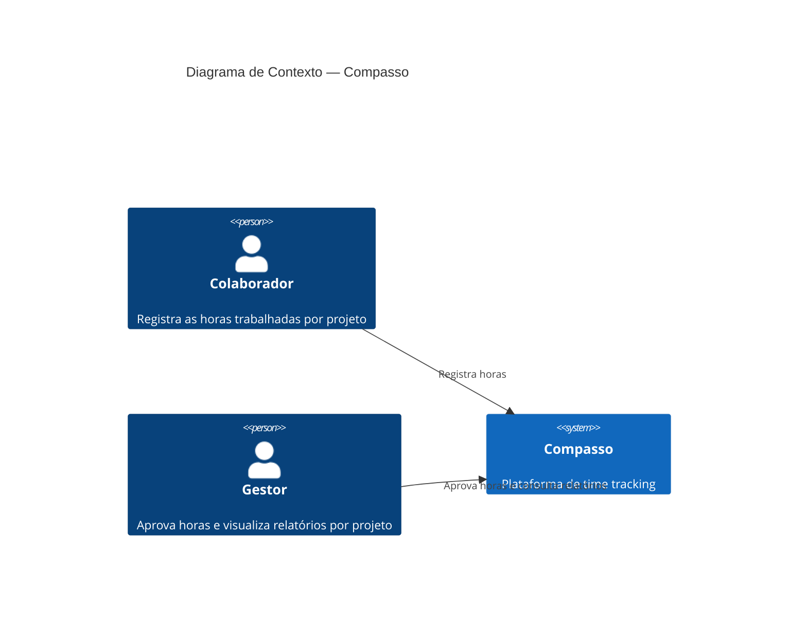
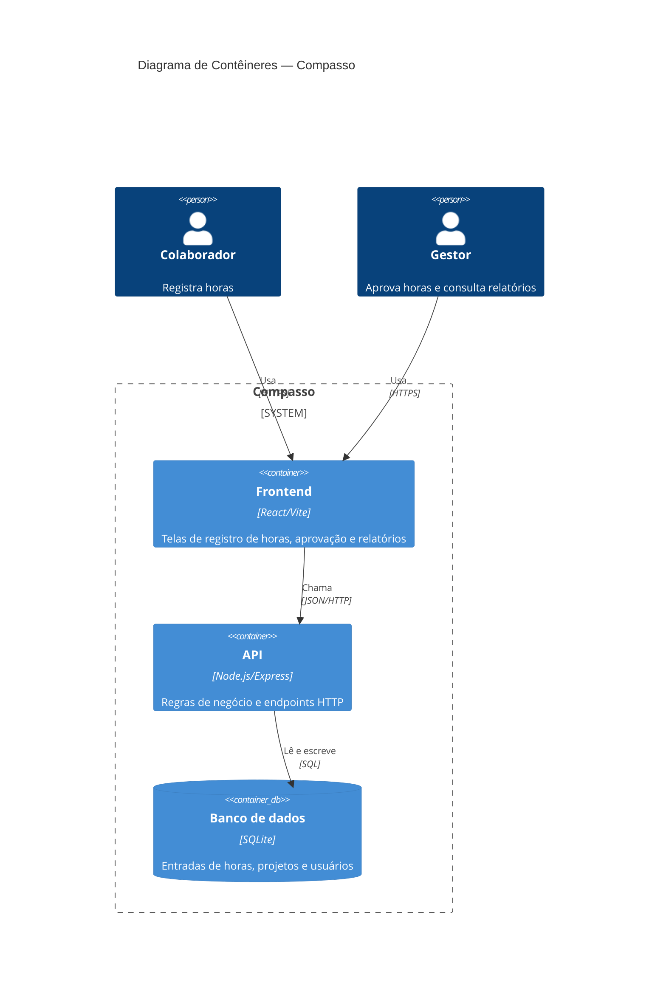
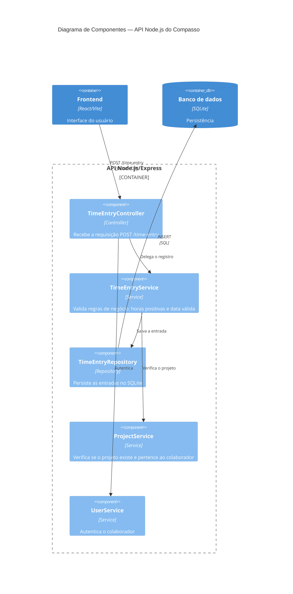
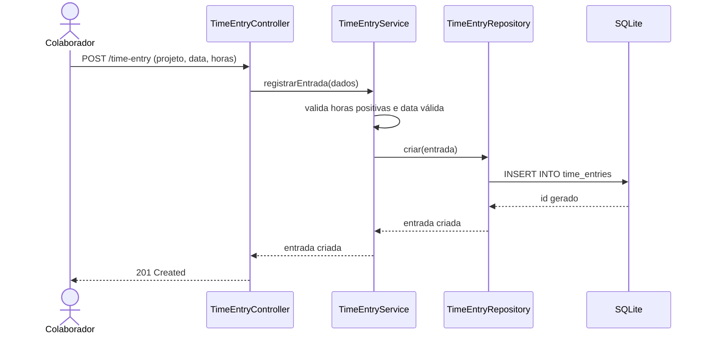
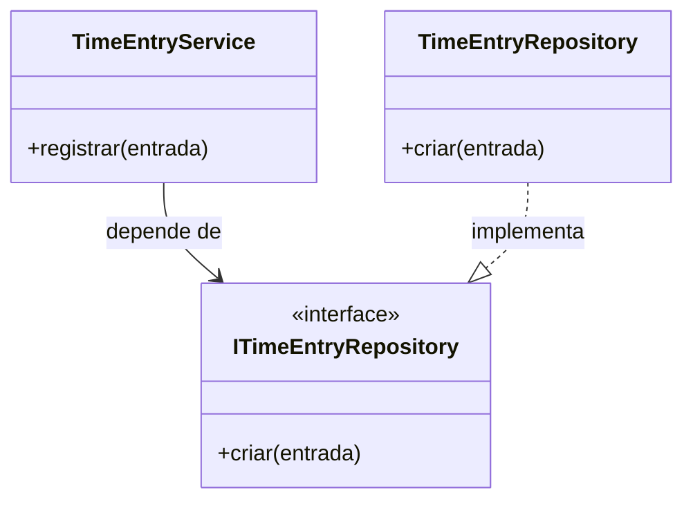

# Semana 7 — Terça-feira

## C4 Model: desenhando a arquitetura do projeto real

**CIN0136: Desenvolvimento de Software | CIn-UFPE |** **E132 | 17:00–18:40**

---

## Leitura Prévia

📖 _Engenharia de Software em Dimensões_ — Cap. 14, seções 14.3.1–14.3.3 (Estrutura hierárquica do C4: Contexto, Contêiner, Componente) e seção 14.4 (C4 vs. UML)

📖 _Engenharia de Software Moderna_ — Cap. 7, seções sobre Camadas e MVC (base conceitual para o Nível 3 do C4)

**Antes de entrar na aula:** traga um esboço (pode ser foto de papel) do que seria o Diagrama de Contexto (Nível 1) do seu projeto. Quem usa o sistema? Com o que ele se conecta?

---

## Objetivos desta aula

Ao final desta aula, você deve ser capaz de:

- Explicar os quatro níveis do C4 Model e o que cada um responde
- Criar um Diagrama de Contexto (N1) para o seu projeto
- Criar um Diagrama de Contêiner (N2) para o seu projeto com tecnologias explícitas
- Esboçar um Diagrama de Componente (N3) para o back-end do seu projeto
- Escrever os diagramas em Mermaid e mantê-los vivos no repositório
- Distinguir contêiner C4 de contêiner Docker e componente C4 de componente React

---

## 1. Uma pergunta antes de começar

> _"Por que documentaríamos a arquitetura se ela vai mudar de qualquer forma?"_

Anote sua resposta agora:

```
Sua resposta inicial:


```

---

## 2. O problema que o C4 resolve

Imagine dois membros da sua equipe começando a codar ao mesmo tempo, sem combinar a estrutura antes. Um cria o back-end em `server/`, o outro em `api/`. No primeiro dia já há conflito de estrutura.

A documentação arquitetural não existe para fixar decisões — existe para **criar um mapa compartilhado** que a equipe pode consultar e atualizar. O mapa muda conforme o sistema cresce. Mas sem mapa, ninguém sabe onde está nem para onde ir.

> _"Decisões esquecidas se repetem. Decisões mal comunicadas geram retrabalho."_

O C4 Model resolve isso com simplicidade: **quatro níveis progressivos de zoom**, cada um respondendo uma pergunta diferente.

---

## 3. Os quatro níveis do C4

| Nível | Nome | Pergunta central | Para quem |
|-------|------|-----------------|-----------|
| 1 | Contexto | Quem usa o sistema e com o que ele se conecta? | Qualquer pessoa |
| 2 | Contêiner | Quais são os grandes blocos técnicos? | Time de desenvolvimento |
| 3 | Componente | O que há dentro de cada bloco? | Desenvolvedores |
| 4 | Código | Como as classes se relacionam? | Raramente documentado |

### Antes de seguir: duas palavras com sentido diferente no C4

| No C4 | O que significa | O que NÃO significa | No Compasso |
|-------|-----------------|---------------------|-------------|
| **Contêiner** | Qualquer processo em execução independente: uma aplicação ou um banco de dados | **Não é um container Docker** | Frontend (React/Vite), API (Node.js/Express) e banco (SQLite) |
| **Componente** | Um módulo dentro de um contêiner C4, com uma responsabilidade clara | **Não é um componente React** | Dentro da API: `TimeEntryController`, `TimeEntryService`, `TimeEntryRepository`, `ProjectService` e `UserService` |

Mesmo sem Docker, o Compasso tem três contêineres C4. E a API não tem nenhum componente React, mas tem cinco componentes C4.

**Regra prática para o seu projeto:** Níveis 1, 2 e 3 são suficientes. O Nível 4 é o código em si — se o código precisar de um diagrama para ser entendido, o problema provavelmente é o código, não a falta de diagrama.

---

## 4. Nível 1 — Diagrama de Contexto

**Pergunta:** quem usa o sistema e com o que ele se conecta?

**O que aparece:**
- Usuários (pessoas com nome e papel)
- O seu sistema (uma única caixa — sem detalhe técnico)
- Sistemas externos com os quais ele se integra

**O que NÃO aparece:** tecnologia, banco de dados, linguagem de programação, estrutura de pastas.

Este é o diagrama que você mostra ao **parceiro na Sprint Review**. Qualquer pessoa deve conseguir entender sem saber programar.

### Exemplo: o Compasso

O **Compasso** é uma plataforma de time tracking: o Colaborador registra as horas trabalhadas por projeto, e o Gestor aprova horas e vê relatórios por projeto. Duas pessoas, uma caixa:


```mermaid
C4Context
  title Diagrama de Contexto — Compasso

  Person(colaborador, "Colaborador", "Registra as horas trabalhadas por projeto")
  Person(gestor, "Gestor", "Aprova horas e visualiza relatórios por projeto")
  System(compasso, "Compasso", "Plataforma de time tracking")

  Rel(colaborador, compasso, "Registra horas")
  Rel(gestor, compasso, "Aprova horas e consulta relatórios")
```

Nesta versão, o Compasso não tem sistema externo. Se passasse a avisar o Gestor por e-mail, uma nova caixa (um sistema externo de e-mail) apareceria no diagrama, e nada mais mudaria no Nível 1.

**Agora faça para o SEU projeto:**

```
Atores do seu sistema (quem usa? com que papel?):
1.
2.
3. (se houver)

Sistemas externos integrados (APIs, serviços de terceiros):
1.
2. (se houver)
```

**Esboço do seu Diagrama de Contexto (N1):**

```
[Use este espaço para rascunhar — pode ser só texto ou uma figura simples]


```

---

## 5. Nível 2 — Diagrama de Contêiner

**Pergunta:** quais são os grandes blocos técnicos e como eles se comunicam?

**O que aparece:**
- Cada processo separado em execução (aplicação web, API, banco de dados, worker)
- A tecnologia de cada um (React/Vite, Node.js/Express, SQLite, etc.)
- A forma de comunicação entre eles (HTTP/REST, JDBC, etc.)

**Regra de ouro:** sempre indique a tecnologia. "Backend" não é suficiente — "Backend API (Node.js/Express)" é.

### Exemplo: o Compasso


```mermaid
C4Container
  title Diagrama de Contêineres — Compasso

  Person(colaborador, "Colaborador", "Registra horas")
  Person(gestor, "Gestor", "Aprova horas e consulta relatórios")

  System_Boundary(compasso, "Compasso") {
    Container(web, "Frontend", "React/Vite", "Telas de registro de horas, aprovação e relatórios")
    Container(api, "API", "Node.js/Express", "Regras de negócio e endpoints HTTP")
    ContainerDb(db, "Banco de dados", "SQLite", "Entradas de horas, projetos e usuários")
  }

  Rel(colaborador, web, "Usa", "HTTPS")
  Rel(gestor, web, "Usa", "HTTPS")
  Rel(web, api, "Chama", "JSON/HTTP")
  Rel(api, db, "Lê e escreve", "SQL")
```

Repare que cada caixa diz a tecnologia. Repare também que existe **uma única API**: é a decisão registrada no ADR-002 (monolito modular). Um sistema maior poderia ter vários microsserviços neste nível.

**Agora faça para o SEU projeto:**

```
Contêineres do seu sistema:

Nome do contêiner 1:          Tecnologia:
Nome do contêiner 2:          Tecnologia:
Nome do contêiner 3:          Tecnologia:
Nome do contêiner 4 (se houver): Tecnologia:

Como eles se comunicam?
Contêiner 1 → Contêiner 2 via:
Contêiner 2 → Contêiner 3 via:
```

**Esboço do Diagrama de Contêiner (N2):**

```
[Rascunhe aqui]


```

---

## 6. Nível 3 — Diagrama de Componente

**Pergunta:** o que há dentro de um contêiner específico?

Normalmente escolhemos o **back-end** para detalhar no N3, porque é onde a lógica de negócio vive. E os componentes que aparecem aqui são exatamente as **pastas** que você implementou:

```
[Rota] ──recebe HTTP──► [Controller] ──orquestra──► [Service] ──acessa──► [Repository] ──► [BD]
```

**Este nível conecta diretamente com a discussão da Semana 6:** a separação em camadas que vocês definiram na arquitetura vira componentes no C4 N3.

**Dica:** se a estrutura de pastas do seu projeto reflete o diagrama de componentes, você já tem metade da documentação feita.

### Exemplo: dentro da API do Compasso


```mermaid
C4Component
  title Diagrama de Componentes — API Node.js do Compasso

  Container(web, "Frontend", "React/Vite", "Interface do usuário")
  ContainerDb(db, "Banco de dados", "SQLite", "Persistência")

  Container_Boundary(api, "API Node.js/Express") {
    Component(tec, "TimeEntryController", "Controller", "Recebe a requisição POST /time-entry")
    Component(tes, "TimeEntryService", "Service", "Valida regras de negócio: horas positivas e data válida")
    Component(ter, "TimeEntryRepository", "Repository", "Persiste as entradas no SQLite")
    Component(ps, "ProjectService", "Service", "Verifica se o projeto existe e pertence ao colaborador")
    Component(us, "UserService", "Service", "Autentica o colaborador")
  }

  Rel(web, tec, "POST /time-entry", "JSON/HTTP")
  Rel(tec, us, "Autentica")
  Rel(tec, tes, "Delega o registro")
  Rel(tes, ps, "Verifica o projeto")
  Rel(tes, ter, "Salva a entrada")
  Rel(ter, db, "INSERT", "SQL")
```

Todos esses componentes vivem dentro do contêiner API: é o zoom na caixa "API" do diagrama anterior. Cada componente tem uma frase de responsabilidade. **Se você não consegue escrever essa frase, o módulo provavelmente mistura assuntos** (coesão baixa, vista na Semana 6).

### Dos componentes à requisição real: `POST /time-entry`

O C4 mostra **quem existe**. O diagrama de sequência mostra **quem chama quem** em uma requisição real.


```mermaid
sequenceDiagram
  actor C as Colaborador
  participant TC as TimeEntryController
  participant TS as TimeEntryService
  participant TR as TimeEntryRepository
  participant DB as SQLite

  C->>TC: POST /time-entry (projeto, data, horas)
  TC->>TS: registrarEntrada(dados)
  TS->>TS: valida horas positivas e data válida
  TS->>TR: criar(entrada)
  TR->>DB: INSERT INTO time_entries
  DB-->>TR: id gerado
  TR-->>TS: entrada criada
  TS-->>TC: entrada criada
  TC-->>C: 201 Created
```

> 💡 Versão simplificada: `ProjectService` e `UserService` também participam (veja o diagrama de componentes).

### E o Nível 4 (código)?

Raramente documentado. Faz sentido para algoritmos muito complexos, padrões de design não óbvios ou integrações específicas com bibliotecas externas. Na prática, o código é a documentação. Um exemplo para o `TimeEntryService`, que depende de uma abstração do repositório, e não de uma implementação ligada ao SQLite (Princípio da Inversão de Dependência):


```mermaid
classDiagram
  class TimeEntryService {
    +registrar(entrada)
  }
  class ITimeEntryRepository {
    <<interface>>
    +criar(entrada)
  }
  class TimeEntryRepository {
    +criar(entrada)
  }
  TimeEntryService --> ITimeEntryRepository : depende de
  TimeEntryRepository ..|> ITimeEntryRepository : implementa
```

**Para o seu projeto — dentro do back-end:**

```
Componentes que existem:

Nome do componente:        Responsabilidade:
                          
Nome do componente:        Responsabilidade:
                          
Nome do componente:        Responsabilidade:
                          
Nome do componente:        Responsabilidade:
```

**Uma pergunta difícil:**

```
Existe alguma responsabilidade no seu back-end que não está claramente
alocada a nenhum componente? O que você faria com ela?


```

---

## 7. Ferramenta: Mermaid

Usamos **Mermaid**: diagramas escritos como texto, que vivem no repositório, versionam junto com o código e qualquer PR pode atualizar. O GitHub renderiza blocos ` ```mermaid ` direto no Markdown.

| Tipo de diagrama | Formato Mermaid |
|------------------|-----------------|
| C4 Contexto (N1) | `C4Context` |
| C4 Contêiner (N2) | `C4Container` |
| C4 Componente (N3) | `C4Component` |
| Sequência (uma requisição) | `sequenceDiagram` |
| Fluxo ou processo | `flowchart TD` ou `flowchart LR` |

**Como trabalhar:** escreva o código no [Mermaid Live Editor](https://mermaid.live), confira o resultado, e cole o bloco no `README.md` ou em `docs/`. A sintaxe C4 do Mermaid é considerada experimental: se algum diagrama não renderizar no seu ambiente, teste no editor online.

**Desvantagem:** o layout automático nem sempre fica bonito. Para o N1 que será mostrado ao parceiro, vale conferir o resultado com cuidado e, se preciso, simplificar o diagrama.

---

## 8. C4 vs. UML — por que C4 para este projeto?

| Critério | C4 Model | UML |
|---------|---------|-----|
| Quantidade de diagramas | 4 níveis | 14 tipos |
| Curva de aprendizado | Baixa | Alta |
| Legibilidade para não-técnicos | Alta | Baixa |
| Adequado para times ágeis | Sim | Com ressalvas |
| Ferramentas | Mermaid | Enterprise Architect, Astah |

Para o nosso contexto — projeto iterativo, equipe pequena, arquitetura em evolução — **C4 é a escolha certa**. UML faz sentido em projetos com requisitos estáveis que exigem especificação técnica precisa.

---

## 9. Fechando o arco: sem mapa, o sistema vira um Big Ball of Mud

Na aula de estilos arquiteturais, vimos o **Big Ball of Mud**: código desorganizado, acoplamento excessivo, baixa coesão, difícil de manter e de evoluir. Ele costuma emergir quando equipes trabalham sob pressão e sem planejamento.

| Big Ball of Mud | O Compasso, com mapa |
|-----------------|----------------------|
| Código desorganizado, sem estrutura clara | Camadas: `routes` → `controllers` → `services` → `repositories` |
| Acoplamento excessivo e baixa coesão | ADRs: SQLite (001) e monolito modular (002) |
| Difícil de manter e de evoluir | Diagramas C4 (N1 a N3) em `docs/` |
| Cresce sem controle, sob pressão e sem planejamento | Quem chega à equipe sabe onde mexer |

Para evitar o Big Ball of Mud: modularização, separação de responsabilidades e uma documentação viva, o **mapa** que a equipe consulta e atualiza.

---

## 10. Reflexão: a arquitetura que vocês planejaram vs. a que vocês têm

Na Sprint Week, vocês codaram sob pressão. Talvez algumas decisões arquiteturais foram feitas no momento, sem discussão.

Responda:

```
1. A estrutura de pastas do projeto está refletindo a arquitetura em camadas
   planejada na Semana 6?
   
   Sim / Não / Parcialmente


2. Se existe divergência, ela foi intencional (vocês decidiram mudar) ou
   acidental (aconteceu sem perceber)?


3. O diagrama C4 que vocês vão criar hoje documenta a arquitetura REAL
   ou a arquitetura PLANEJADA? Isso importa?


```

---

## 11. Questão estruturante para reflexão

> _"Considerando que a arquitetura de um software evolui ao longo do desenvolvimento, qual é o valor de documentá-la desde o início do projeto?"_

Esta pergunta volta à pergunta 1 desta aula. Releia o que você escreveu lá. Sua resposta mudou?

```
Resposta revisada (se mudou):


```

---

## 12. Para o próximo encontro (lab de quinta — Sprint 1 Review)

Na **quinta-feira**, vocês têm o **Sprint 1 Review com o parceiro**. Isso significa:

- O **Diagrama de Contexto (N1)** deve estar pronto para mostrar ao parceiro — ele não sabe programar, mas consegue validar se os atores e conexões fazem sentido
- O **Diagrama de Contêiner (N2)** deve estar no repositório — commitado, não só no papel
- A **demo do produto** deve mostrar pelo menos uma feature funcional de ponta a ponta

📋 **Entregável desta semana:** Diagramas C4 N1 e N2 commitados no repositório + esboço do N3

---

## Espaço para anotações da aula

```
[Use este espaço livremente durante a aula — especialmente durante o hands-on com Mermaid]


```

---

_CIN0136 — Desenvolvimento de Software | CIn-UFPE_
_Referências: Garcia, V. C. Engenharia de Software em Dimensões. ASSERT Lab, 2025. Cap. 14, seções 14.3–14.4. Valente, M. T. Engenharia de Software Moderna. Cap. 7._
